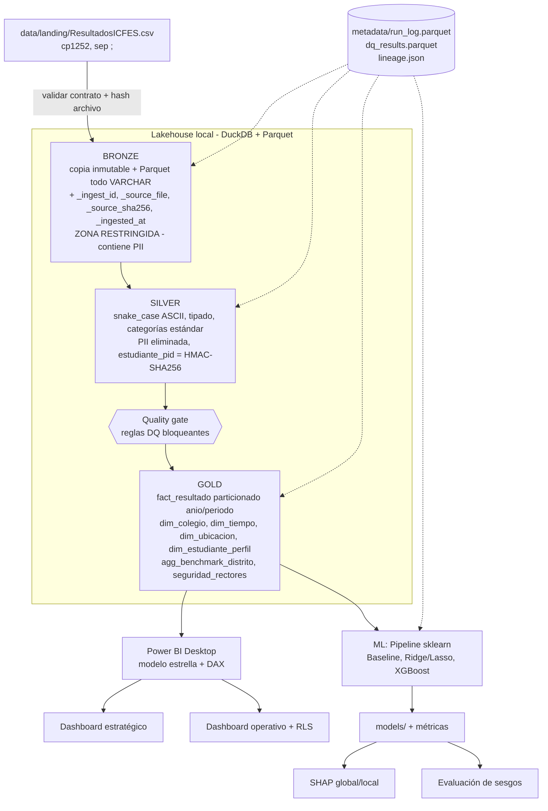
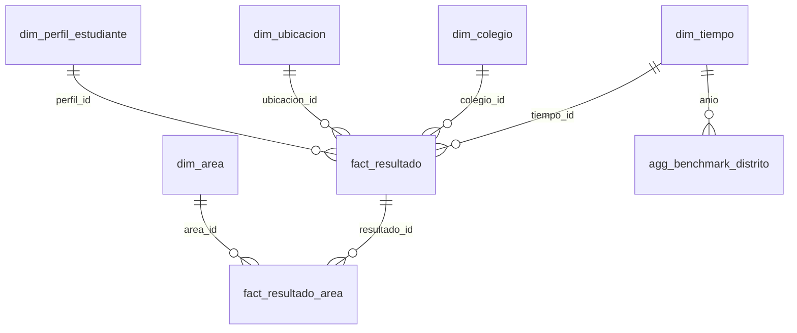

# Plan maestro de trabajo técnico — Análisis Saber 11 (Lakehouse + BI + ML)

## 1. Resumen ejecutivo

Se construirá, con costo cero de licenciamiento en la fase de desarrollo local, una solución que: (1) ingiere `ResultadosICFES.csv` a un Lakehouse Medallion (Bronze/Silver/Gold) en Parquet con DuckDB + Python; (2) expone un modelo estrella a Power BI Desktop para un dashboard estratégico; (3) un dashboard operativo por colegio con RLS dinámico; (4) modelos Ridge/Lasso y XGBoost explicados con SHAP, con evaluación de sesgos.

El perfilamiento revela **hallazgos que cambian el diseño** respecto a `Objetivos.md`:

| # | Hallazgo verificado en el CSV | Consecuencia |
|---|---|---|
| H1 | 899 filas, 23 columnas, separador `;`, codificación **Windows-1252** (no UTF-8) | `read_csv_auto` por defecto fallará o corromperá tildes; hay que declarar `delim=';'` y encoding |
| H2 | `zona` = solo "Urbana"; `naturaleza_colegio` = solo "Pública"; `pais/departamento/municipio` constantes; `periodo` = solo "II" | **Benchmarking Oficial vs No Oficial y Urbano vs Rural no es calculable** con estos datos; estas variables no aportan al ML (varianza cero) |
| H3 | 3 colegios (ABC, RST, XYZ) y cada uno tiene **exactamente un** modelo pedagógico | Efecto "modelo pedagógico" está **totalmente confundido** con el efecto colegio; SHAP no puede separarlos |
| H4 | `Global` = `round(5·(3·(LC+MAT+SOC+CN)+ING)/13)` en **899/899** filas | Usar puntajes por área como predictores del Global es **leakage determinista** |
| H5 | `nroDoc` único, entero secuencial **1..899** | SHA-256 sin secreto es **reversible por enumeración** en milisegundos |
| H6 | Existen `nombre1, nombre2, apellido1, apellido2` (no mencionados en `Objetivos.md`) | Datos personales directos adicionales; deben eliminarse en Silver |
| H7 | Cada estudiante aparece **una sola vez** (un año, un colegio); sin nulos ni duplicados | No se requiere agrupar por estudiante en la validación; sí considerar colegio y año |
| H8 | Años 2021–2024 (258/236/223/182); sexo M=700 / F=199; estrato 1–3 | Tendencias viables (4 puntos); desbalance por sexo relevante para sesgos |
| H9 | `grupo` con 3 valores ("11°1..11°3", carácter afectado por codificación) | Normalizar carácter; variable de baja utilidad analítica |
| H10 | Rango Global 291–477; áreas 45–100; Inglés 50–100 | Escalas **confirmadas por el usuario**: áreas 0–100, Global 0–500. El mínimo observado (45) no es un límite de validez |

**El CSV es una base de ejemplo con datos inventados.** Por eso el plan incluye la fase **F1b — Ampliación con datos ficticios** (§8, script completo `scripts/generar_datos_ficticios.py`) que agrega registros ficticios al CSV para resolver H2, H3, H7 (pocos colegios para validar por grupo) y H8, conservando el formato (cp1252, `;`, 23 columnas) y la regla del Global (H4). El diseño hace **independientes** los factores de colegio (naturaleza, zona, periodo, modelo) y de estudiante (estrato, sexo, año), para que ML y SHAP puedan separar sus efectos.

| Hallazgo | ¿Lo resuelve F1b? | Cómo |
|---|---|---|
| H1 encoding/separador | No se "resuelve": se **conserva** a propósito | El pipeline debe soportar el formato real de la fuente |
| H2 variables constantes | **Sí** | Colegios Privados, zona Rural, periodo "I" (ficticio), estratos 1–6 en todos los colegios |
| H3 colegio ≡ modelo pedagógico | **Sí** | 16 colegios en diseño ortogonal: cada modelo pedagógico (se agrega "Tradicional") en 4 colegios, con ambos niveles de naturaleza, zona y periodo |
| H4 Global = f(áreas) | Se **conserva** | Es regla del examen; se controla como leakage |
| H5 `nroDoc` secuencial | Parcial | Nuevos `nroDoc` ficticios aleatorios de 10 dígitos; la seudonimización HMAC sigue siendo necesaria |
| H6 nombres | Se conservan (ficticios) | Sirven para probar la eliminación de PII |
| H7 solo 3 colegios | **Sí** | 16 colegios → `GroupKFold` por colegio viable |
| H8 desbalance por sexo | **Sí** | Composición objetivo idéntica en cada colegio-año (50 % F / 50 % M); en ABC/RST/XYZ se agregan estudiantes hasta alcanzarla |

La ejecución la realizan **agentes de IA** con puntos de revisión humana; el cronograma se expresa como **secuencia de lotes de ejecución** (§9), no como capacidad de un equipo de personas.

---

## 2. Análisis de `Objetivos.md`

1. **Objetivo general inferido:** construir, sin costo de servidores/licencias, una plataforma analítica de resultados Saber 11 que soporte decisiones de la Dirección de Calidad y de rectores y cuantifique la asociación de factores sociodemográficos/pedagógicos con los puntajes.
2. **Objetivos específicos:** O1 Lakehouse Parquet Medallion; O2 Dashboard estratégico; O3 Dashboard operativo con RLS; O4 Modelos ML + SHAP.
3. **Productos esperados:** `pipeline_lakehouse.py`; directorio Parquet particionado; `.pbix` estratégico y operativo (mismo archivo o dependiente); tabla `Seguridad_Rectores`; `modelos_ml_shap.py`; `impacto_variables_shap.png`.
4. **Fuentes de datos:** un CSV de resultados (en el documento `datos_saber11.csv`; en el repo `ResultadosICFES.csv`) y la tabla de seguridad (Excel/CSV) — esta última **Pendiente de definición** (contenido real).
5. **Tecnologías:** Python, DuckDB, Parquet (Snappy), SQL, Power BI Desktop, DAX, Power Query, Scikit-Learn, XGBoost, SHAP, Pandas, Matplotlib, Jupyter.
6. **Transformaciones:** tipado, normalización de nombres de columnas, tratamiento de atípicos/nulos documentado, SHA-256 de `nroDoc`, `COALESCE(periodo,'Unica') AS jornada`, particionado por año y jornada.
7. **Requerimientos BI:** conexión a carpeta Parquet; modelo estrella (`Dim_Colegio`, `Dim_Tiempo`, `Dim_Ubicacion`); medidas Promedio Global, Diferencial Sector, Diferencial Zona; tarjetas KPI, barras agrupadas por área, tendencia 2021–2024; vista de percentiles/niveles de desempeño; comparativo colegio vs distrito.
8. **Seguridad:** hashing de `nroDoc`; RLS con `USERPRINCIPALNAME()`; rol `Rol_Rector`.
9. **ML:** objetivo `puntaje_global` o por área; predictores estrato, zona, naturaleza, modelo pedagógico, sexo; One-Hot + escalado; Ridge/Lasso y XGBoost; R², RMSE, MAE con k-fold.
10. **Explicabilidad:** `shap.TreeExplainer` sobre XGBoost; summary/beeswarm.
11. **Dependencias:** O1 → O2, O3, O4; O2 (modelo estrella) → O3; tabla de seguridad → O3.
12. **Riesgos técnicos:** ver §26 (codificación, leakage, confusión colegio/modelo, reversibilidad del hash; mitigados: Python 3.12 fijado y RLS validado en Service con trial 60 días).
13. **Vacíos (Pendiente de definición):** usuarios/rectores reales y sus UPN; puntos de corte oficiales de niveles de desempeño; definición de "distrito" (se asume municipio Santa Marta); fecha de inicio; tamaño del equipo; política de retención; responsable de datos; si se necesita re-identificación futura; objetivo(s) exacto(s) del ML (global vs áreas).
14. **Supuestos:** ver §4.

---

## 3. Alcance

**Incluido:** los 4 objetivos completos; perfilamiento; calidad de datos; pruebas; sesgos; automatización; seguridad; documentación; publicación en Power BI Service/Fabric (usando licencia de prueba de 60 días) para validación real de RLS con usuarios Viewer.
**Excluido (salvo decisión posterior):** infraestructura en nube de pago permanente tras el trial, orquestadores (Airflow, etc.), ingesta de fuentes adicionales, validación jurídica (se deja como actividad pendiente).

---

## 4. Supuestos

- S1 **El plan lo ejecutan agentes de IA** (no un equipo de personas); no se dimensiona capacidad humana. Se mantiene un **supervisor humano** solo para aprobaciones (gates) y acciones que requieran la interfaz gráfica de Power BI Desktop si el agente no puede operarla.
- S2 Sin fecha de inicio: el cronograma es una **secuencia ordenada de lotes de ejecución** con esfuerzo relativo; no hay fechas calendario.
- S3 Ejecución local en Windows (Power BI Desktop solo existe para Windows).
- S4 "Distrito" = municipio `Santa Marta` (todos los registros, originales y ficticios, pertenecen a él).
- S5 `periodo` cumple el rol de "jornada" del documento (así lo plantea `Objetivos.md`).
- S6 **`ResultadosICFES.csv` contiene datos inventados** y se ampliará con más datos ficticios (F1b). Aun así, nombres y `nroDoc` se tratan **como si fueran reales** para que los controles de privacidad queden probados.
- S7 Los efectos incorporados por el generador (estrato, naturaleza, zona, modelo, sexo, año) son **parámetros sintéticos**: los resultados de ML/SHAP sobre estos datos validan el pipeline, **no** describen la realidad educativa.
- S8 El entorno queda fijado en **Python 3.12** para garantizar total compatibilidad de ruedas precompiladas en Windows (`numba`, `shap`, `xgboost`, `duckdb`).
- S9 Se cuenta con una **licencia de prueba de 60 días de Power BI Service / Fabric**, lo que permite publicar el informe y comprobar RLS dinámico efectivo asignando usuarios con rol Viewer.

---

## 5. Arquitectura objetivo



| Componente | Responsabilidad | Entrada | Salida / formato | Ubicación |
|---|---|---|---|---|
| Landing | Recibir CSV sin tocar | CSV externo | CSV | `data/landing/` (no versionado) |
| Contrato de fuente | Validar columnas, separador, encoding, nº columnas | CSV | `reports/quality/source_check_<run_id>.json` | `src/saber11/ingest/contract.py` |
| Bronze | Preservar fuente + metadatos de ingesta | CSV | copia `raw/<sha256>.csv` + `bronze_resultados.parquet` | `data/bronze/` (restringido) |
| Silver | Limpieza, tipado, seudonimización, minimización | Bronze | `silver_resultados.parquet` | `data/silver/` |
| Quality | Reglas DQ, umbrales, bloqueo | Silver / Gold | `dq_results.parquet`, informe HTML/MD | `data/metadata/`, `reports/quality/` |
| Gold | Modelo estrella + agregados | Silver aprobado | Parquet por tabla; hechos particionados | `data/gold/` |
| BI | Modelo semántico, DAX, RLS | Gold | `.pbix` | `powerbi/` (no versionado si contiene datos) |
| ML | Entrenar/evaluar/seleccionar | Gold (vista ML) | `models/<run_id>/model.joblib`, `metrics.json` | `models/`, `reports/ml/` |
| SHAP / Sesgos | Explicaciones y desempeño por subgrupo | modelo + test | PNG, CSV de valores SHAP, `fairness.csv` | `reports/shap/`, `reports/fairness/` |

**Trazabilidad:** cada ejecución genera `run_id` (UTC timestamp + hash corto), registra hash SHA-256 del CSV, versión de código (`git rev-parse HEAD`), versiones de librerías, parámetros y conteos por capa en `data/metadata/run_log.parquet`; cada fila Bronze/Silver lleva `_ingest_id`.

---

## 6. Flujo de datos

1. `landing` → **contrato** (23 columnas esperadas, `;`, cp1252, `año` 4 dígitos) → si falla, abortar con código ≠ 0.
2. **Bronze**: copiar CSV a `data/bronze/raw/<sha256>.csv` (inmutable); leer todo como VARCHAR:
   ```sql
   CREATE OR REPLACE TABLE bronze_resultados AS
   SELECT *, '${run_id}' AS _ingest_id, '${file}' AS _source_file,
          '${sha256}' AS _source_sha256, now() AS _ingested_at
   FROM read_csv('${file}', delim=';', header=true, all_varchar=true, encoding='cp1252');
   ```
   *(Verificado en F2 con DuckDB 1.5.5: `encoding='cp1252'` y `'latin-1'` son aceptados y producen valores idénticos a pandas con cp1252; `'windows-1252'` e `'iso-8859-1'` no. Se usa el valor `cp1252` del contrato. `run_log` guarda `run_id, etapa, estado, iniciado_utc, finalizado_utc, filas, source_sha256, git_sha, python_version, duckdb_version, detalle`.)*
3. **Silver**: renombrar (`año→anio`, `Lectura Crítica→punt_lectura_critica`, `Matemáticas→punt_matematicas`, `Sociales y Ciudadana→punt_sociales`, `Ciencias Naturales→punt_ciencias`, `Inglés→punt_ingles`, `Global→puntaje_global`), `TRY_CAST` a tipos, normalizar categorías, `estudiante_pid = HMAC-SHA256(secret, nroDoc)` calculado en Python, **eliminar** `nroDoc`, `nombre1..apellido2`.
4. **Quality gate** (§20) sobre Silver → si una regla bloqueante falla, no se construye Gold.
5. **Gold**: dimensiones con claves sustitutas, hechos, agregados de benchmark, tabla de seguridad.
6. **Consumo**: Power BI (Parquet) y ML (DuckDB → pandas).

---

## 7. WBS

```text
1. Preparación y gobierno
   1.1 Arquitectura: 1.1.1 ADRs iniciales  1.1.2 Diagrama  1.1.3 Convenciones de nombres
   1.2 Entorno: 1.2.1 Configuración Python 3.12  1.2.2 venv  1.2.3 requirements + lock con pip-tools
   1.3 Repositorio: 1.3.1 Estructura  1.3.2 .gitignore (data/, *.pbix, .env)  1.3.3 pre-commit/ruff
   1.4 Configuración: 1.4.1 config/settings.yaml  1.4.2 .env.example (HMAC_KEY)  1.4.3 logging
   1.5 Gobierno: 1.5.1 Clasificación de columnas  1.5.2 Política de acceso  1.5.3 Registro de pendientes
2. Datos
   2.1 Perfilamiento: 2.1.1 Estructura/encoding  2.1.2 Nulos/duplicados  2.1.3 Cardinalidad/constantes
       2.1.4 Rangos/atípicos  2.1.5 Relación Global-áreas  2.1.6 Sensibles  2.1.7 Informe
   2.2 Bronze: 2.2.1 Contrato fuente  2.2.2 Copia inmutable  2.2.3 Parquet VARCHAR + metadatos  2.2.4 run_log
   2.3 Silver: 2.3.1 Renombrado  2.3.2 Tipado  2.3.3 Categorías  2.3.4 Nulos/atípicos  2.3.5 HMAC  2.3.6 Minimización
   2.4 Gold: 2.4.1 Dimensiones  2.4.2 Hechos  2.4.3 Agregados benchmark  2.4.4 Seguridad  2.4.5 Particionado/optimización
   2.5 Calidad: 2.5.1 Catálogo reglas YAML  2.5.2 Motor de reglas  2.5.3 Umbrales/gate  2.5.4 Informe DQ
3. BI
   3.1 Modelo: 3.1.1 Conexión parametrizada  3.1.2 Relaciones  3.1.3 Tabla de medidas  3.1.4 Ocultar técnicas
   3.2 DAX: 3.2.1 Medidas base  3.2.2 Benchmarking  3.2.3 Tendencias  3.2.4 Percentiles  3.2.5 Validación vs SQL
   3.3 Dashboard estratégico: 3.3.1 Wireframe  3.3.2 Páginas  3.3.3 Segmentadores  3.3.4 Revisión usuario
   3.4 Dashboard operativo: 3.4.1 Página colegio  3.4.2 Distribución/percentiles  3.4.3 Colegio vs distrito
   3.5 RLS: 3.5.1 Tabla seguridad  3.5.2 Rol DAX  3.5.3 Casos de prueba  3.5.4 Evidencias
4. ML
   4.1 Preparación: 4.1.1 Vista ml_dataset  4.1.2 Selección variables  4.1.3 Split temporal  4.1.4 Pipeline
   4.2 Baseline: 4.2.1 DummyRegressor media  4.2.2 Media por colegio-año
   4.3 Ridge/Lasso: 4.3.1 CV alpha  4.3.2 Coeficientes
   4.4 XGBoost: 4.4.1 Búsqueda hiperparámetros  4.4.2 Early stopping interno
   4.5 Validación: 4.5.1 Métricas CV  4.5.2 Holdout 2024  4.5.3 Leave-one-school-out  4.5.4 IC bootstrap  4.5.5 Selección
   4.6 SHAP: 4.6.1 Global  4.6.2 Beeswarm  4.6.3 Dependencia  4.6.4 Local  4.6.5 Interpretación
   4.7 Sesgos: 4.7.1 Métricas por subgrupo  4.7.2 Residuos  4.7.3 Informe
5. QA
   5.1 Tests: unitarios, datos, integración  5.2 Validación funcional BI  5.3 Seguridad  5.4 Reproducibilidad
6. Entrega
   6.1 Documentación (diccionario, linaje, ADRs)  6.2 Manual técnico  6.3 Manual de usuario  6.4 Entrega final
```

---

## 8. Plan de trabajo por fases

> Formato por fase: Objetivo · Actividades/Subactividades · Entrada · Proceso · Herramientas · Salida · Entregable · Responsable · Dependencias · Criterio de aceptación · Riesgos · Mitigación.
> **Responsables (agentes de IA):** **AG-ARQ** arquitectura/ADRs · **AG-DAT** ingeniería de datos (F0–F5, F1b) · **AG-BI** Power BI/DAX (F6–F7, vía archivos `.pbip` y/o MCP de modelado de Power BI) · **AG-ML** ML/SHAP/sesgos (F8–F10) · **AG-QA** pruebas y verificación independiente (F12) · **AG-SEC** revisión de seguridad (F13) · **AG-DOC** documentación (F14) · **SUP** supervisor humano (aprueba gates, clave HMAC, pruebas visuales en Desktop). Regla: el agente que implementa no es el que verifica (AG-QA verifica).

### F0 — Preparación y gobierno
| Campo | Contenido |
|---|---|
| Objetivo | Repositorio, entorno reproducible en Python 3.12, convenciones y manejo de secretos listos |
| Actividades | 1) Estructura (§12). 2) `.gitignore`: `data/**`, `*.pbix`, `.env`, `models/**/*.joblib` (según política). 3) Entorno: `py -3.12 -m venv .venv`. 4) Fijar versiones (`pip-tools`: `requirements.in` → `requirements.txt` con hashes). 5) `config/settings.yaml` (rutas, encoding, separador, semillas, umbrales DQ). 6) `.env.example` con `SABER11_HMAC_KEY=`. 7) `ruff` + `pytest` + `pre-commit`. 8) `docs/adr/0001..` iniciales. 9) Clasificación de columnas (§16). |
| Entrada | `Objetivos.md`, `PROMPT.md`, CSV |
| Proceso | Scripts manuales + verificación con `python -c "import duckdb, pandas, sklearn, xgboost, shap"` |
| Herramientas | Git, Python 3.12, pip-tools, ruff, pytest |
| Salida / Entregable | Repo estructurado, `requirements.txt` fijado, `README.md` inicial, `docs/adr/` |
| Dependencias | — |
| Criterio de aceptación | Entorno limpio instala sin errores bajo Python 3.12; import de las 5 librerías OK; `git status` no muestra CSV ni `.env` |
| Riesgos | Incompatibilidad puntual de versiones en lockfile |
| Mitigación | Resolver dependencias fijando versiones en `requirements.in` |

### F1 — Perfilamiento de datos
| Campo | Contenido |
|---|---|
| Objetivo | Conocer estructura, calidad y sensibilidad antes de diseñar reglas |
| Actividades | Estructura/encoding; tipos; nulos; duplicados (fila, `nroDoc`, `nroDoc+anio`); cardinalidad y **columnas constantes**; rangos y atípicos (IQR, z-score); verificación de la fórmula del Global; dependencias funcionales (colegio→modelo pedagógico/naturaleza/zona); distribución por año/colegio/sexo/estrato; identificación de PII |
| Entrada | CSV |
| Proceso | `src/saber11/profiling/profile.py`, que produce Markdown y JSON reutilizables (se resolvió sin cuadernos: nada que limpiar antes de versionar, §21.11) |
| Herramientas | DuckDB (`SUMMARIZE`), pandas, matplotlib |
| Salida / Entregable | `reports/profiling/perfilamiento_v1.md` + `profile_<sha>.json` |
| Dependencias | F0 |
| Criterio de aceptación | Documenta H1–H10 con cifras reproducibles; cada columna clasificada (PII directa / identificador / cuasi-identificador / analítica) |
| Riesgos | Informe con datos personales |
| Mitigación | El informe solo contiene agregados; sin filas de muestra con nombres/documento |

Consulta de ejemplo:
```sql
SUMMARIZE SELECT * FROM read_csv('data/landing/ResultadosICFES.csv', delim=';', header=true);
SELECT count(*) FILTER (WHERE "Global" <> round(5*(3*("Lectura Crítica"+"Matemáticas"+"Sociales y Ciudadana"+"Ciencias Naturales")+"Inglés")/13.0)) AS filas_inconsistentes FROM src;
```

### F1b — Ampliación del CSV con datos ficticios
| Campo | Contenido |
|---|---|
| Objetivo | Agregar al CSV de ejemplo los registros ficticios necesarios para que los 4 objetivos sean demostrables (benchmarking sector/zona, efecto modelo pedagógico separable del colegio, validación por grupos, sesgos por zona/naturaleza/sexo) |
| Actividades | 1) Respaldo inmutable del original (`ResultadosICFES.original.csv` + SHA-256). 2) Definir 13 colegios ficticios que, con ABC/RST/XYZ, forman una fracción ortogonal 2^(3-1) de naturaleza × zona × periodo con los 4 modelos pedagógicos en cada celda (16 colegios; todo par de factores de colegio balanceado). 3) Fijar una composición objetivo de estrato × sexo idéntica para todo colegio-año (asignación exacta por mayor resto) y completar ABC/RST/XYZ hasta alcanzarla. 4) Calibrar el nivel base de área con la media del CSV original. 5) Generar puntajes con modelo latente (habilidad común + efectos aditivos + ruido), áreas recortadas a 0–100 y `Global` por la fórmula verificada (H4, 0–500). 6) Anexar al CSV conservando encoding cp1252, `;`, orden de columnas y fin de línea. 7) Guardar parámetros de generación (verdad de referencia para validar SHAP). 8) Validar automáticamente H2, H3, H7, H8, balance del diseño e independencia (Cramér V ≤ 0,05 entre todo par de factores). 9) Re-ejecutar F1 sobre el CSV ampliado |
| Entrada | `ResultadosICFES.csv` (899 filas) |
| Proceso | `python scripts/generar_datos_ficticios.py --csv ResultadosICFES.csv --seed 20260913` |
| Herramientas | Python, pandas, NumPy |
| Salida | CSV ampliado (≈ 14.700 filas con los parámetros por defecto; ≈ 230 estudiantes por colegio-año), respaldo, `reports/datos_ficticios/parametros_generacion.json`, `reports/datos_ficticios/validacion_ampliacion.json` |
| Entregable | E28 script + E29 CSV ampliado + informe de validación |
| Responsable | AG-DAT (implementa), AG-QA (verifica), SUP (aprueba reemplazo del CSV) |
| Dependencias | F0, F1 (perfil del original) |
| Criterio de aceptación | Script idempotente (segunda ejecución aborta sin `--force`); filas originales intactas (hash de las primeras 899 filas = original); `zona` ∈ {Urbana, Rural}; `naturaleza_colegio` ∈ {Pública, Privada}; 16 colegios; cada modelo pedagógico en 4 colegios y en ambos niveles de naturaleza, zona y periodo; tablas cruzadas de colegios por pares de factores con conteos iguales; estratos 1–6 presentes en cada nivel de cada factor de colegio; **Cramér V ≤ 0,05** entre todo par de factores (colegio–colegio y estudiante–colegio); % Femenino por colegio-año entre 45 % y 55 %; áreas en 0–100 y `Global` en 0–500; `Global` = fórmula en 100 % de filas; `nroDoc` único; archivo legible con `sep=';', encoding='cp1252'` |
| Riesgos | Efectos sintéticos interpretados como hallazgos reales; romper el formato de la fuente; semilla no fijada |
| Mitigación | Parámetros publicados y advertencia en informes (S7); validación de formato en el propio script; `--seed` obligatorio con valor por defecto registrado |

**Diseño de colegios ficticios** (fracción ortogonal: celdas con naturaleza ⊕ zona ⊕ periodo par; los 4 modelos en cada celda):

| Celda (naturaleza, zona, periodo) | Aprendizaje basado en proyectos | Constructivista | Pedagogía conceptual | Tradicional |
|---|---|---|---|---|
| Pública, Urbana, II | XYZ (original) | RST (original) | ABC (original) | YZA |
| Pública, Rural, I | DEF | GHI | JKL | BCD |
| Privada, Urbana, I | MNO | PQR | STU | EFG |
| Privada, Rural, II | HIJ | VWX | KLM | NOP |

Composición de estudiantes en **todo** colegio-año: estrato 1–6 con proporciones (0,22; 0,22; 0,22; 0,14; 0,12; 0,08) × sexo 50/50. Efecto fijo de colegio con suma 0 por modelo y por celda. Efecto de periodo = 0 (control negativo para SHAP). Consecuencia: ningún factor de colegio predice el estrato, el sexo o el año, y ningún par de factores de colegio está confundido.

**Código — `scripts/generar_datos_ficticios.py`:**
```python
"""Amplía ResultadosICFES.csv con registros FICTICIOS.

Los datos originales son inventados; este script agrega más registros inventados para
resolver los hallazgos del perfilamiento (H2, H3, H7, H8) sin alterar las filas existentes,
con un diseño que permite a los modelos y a SHAP separar los efectos de cada factor:

* Colegios: fracción ortogonal 2^(3-1) de naturaleza × zona × periodo, con los 4 modelos
  pedagógicos en cada celda (16 colegios). Todo par de factores de colegio queda balanceado.
* Estudiantes: en cada colegio-año, estrato y sexo siguen la MISMA distribución objetivo
  (independientes entre sí y de los factores de colegio). A los colegios originales se les
  agregan estudiantes hasta alcanzar esa composición.
* Puntajes de área en 0..100; Global = rint(5·(3·(LC+MAT+SOC+CN)+ING)/13) en 0..500.

ADVERTENCIA: los efectos usados para generar puntajes son parámetros sintéticos.
Ningún resultado analítico obtenido con estos datos describe la realidad.

Uso:
    python scripts/generar_datos_ficticios.py --csv ResultadosICFES.csv --seed 20260913
    python scripts/generar_datos_ficticios.py --csv ResultadosICFES.csv --force   # regenerar desde el respaldo
"""
from __future__ import annotations

import argparse
import hashlib
import itertools
import json
import math
import shutil
import sys
from dataclasses import asdict, dataclass
from pathlib import Path

import numpy as np
import pandas as pd

ENCODING = "cp1252"
SEP = ";"
ANIOS = (2021, 2022, 2023, 2024)
AREAS = ("Lectura Crítica", "Matemáticas", "Sociales y Ciudadana", "Ciencias Naturales", "Inglés")
COLUMNAS = [
    "año", "periodo", "pais", "departamento", "municipio", "zona", "estrato",
    "nombre_colegio", "naturaleza_colegio", "modelopedag_colegio", "nroDoc",
    "nombre1", "nombre2", "apellido1", "apellido2", "sexo", "grupo", "Global", *AREAS,
]
FACTORES_COLEGIO = ("naturaleza_colegio", "zona", "periodo", "modelopedag_colegio")
FACTORES_ESTUDIANTE = ("estrato", "sexo", "año")
MAX_AREA, MAX_GLOBAL = 100, 500

# ---------------------------------------------------------------- composición objetivo por colegio-año
ESTRATOS = (1, 2, 3, 4, 5, 6)
PROP_ESTRATO = (0.22, 0.22, 0.22, 0.14, 0.12, 0.08)
SEXOS = ("Femenino", "Masculino")
PROP_SEXO = (0.5, 0.5)
VARIACION_TAMANO = 0.05     # ±5 % en el tamaño de colegios nuevos por año

# ---------------------------------------------------------------- parámetros sintéticos
SD_HABILIDAD = 8.0          # habilidad del estudiante compartida entre áreas
SD_RUIDO_AREA = 7.0         # ruido independiente por área
EFECTO_ESTRATO = 2.5        # puntos por nivel de estrato por encima de 2
EFECTO_PRIVADA = 4.0
EFECTO_RURAL = -4.0
EFECTO_PERIODO_I = 0.0      # sin efecto: sirve de control negativo para SHAP
EFECTO_ANIO = 0.8           # tendencia por año desde 2021
EFECTO_MODELO = {
    "Aprendizaje basado en proyectos": 1.5,
    "Constructivista": 1.0,
    "Pedagogía conceptual": 0.5,
    "Tradicional": 0.0,
}
EFECTO_SEXO_AREA = {        # (Femenino, Masculino) por área
    "Matemáticas": (-1.5, 1.5),
    "Lectura Crítica": (1.5, -1.5),
}
EFECTO_INGLES_PRIVADA = 5.0


@dataclass(frozen=True)
class Colegio:
    nombre: str
    naturaleza: str
    zona: str
    modelo: str
    periodo: str
    efecto_colegio: float   # efecto fijo del colegio; suma 0 por modelo y por celda
    n_grupos: int = 3


ABP, CON, PCO, TRA = EFECTO_MODELO
# Celdas con naturaleza⊕zona⊕periodo par: (Pública,Urbana,II) (Pública,Rural,I) (Privada,Urbana,I) (Privada,Rural,II).
# La celda (Pública,Urbana,II) ya contiene ABC, RST y XYZ; se completa con YZA.
COLEGIOS_NUEVOS = (
    Colegio("YZA", "Pública", "Urbana", TRA, "II", 0.0),
    Colegio("DEF", "Pública", "Rural", ABP, "I", 1.0),
    Colegio("GHI", "Pública", "Rural", CON, "I", -1.0),
    Colegio("JKL", "Pública", "Rural", PCO, "I", 0.5),
    Colegio("BCD", "Pública", "Rural", TRA, "I", -0.5),
    Colegio("MNO", "Privada", "Urbana", ABP, "I", -1.0),
    Colegio("PQR", "Privada", "Urbana", CON, "I", 1.0),
    Colegio("STU", "Privada", "Urbana", PCO, "I", -0.5),
    Colegio("EFG", "Privada", "Urbana", TRA, "I", 0.5),
    Colegio("HIJ", "Privada", "Rural", ABP, "II", 0.0),
    Colegio("VWX", "Privada", "Rural", CON, "II", 0.0),
    Colegio("KLM", "Privada", "Rural", PCO, "II", 0.0),
    Colegio("NOP", "Privada", "Rural", TRA, "II", 0.0),
)

UMBRAL_CRAMER_V = 0.05


# ---------------------------------------------------------------- utilidades
def sha256_archivo(ruta: Path) -> str:
    h = hashlib.sha256()
    with ruta.open("rb") as f:
        for bloque in iter(lambda: f.read(1 << 20), b""):
            h.update(bloque)
    return h.hexdigest()


def fin_de_linea(ruta: Path) -> str:
    with ruta.open("rb") as f:
        return "\r\n" if b"\r\n" in f.read(65536) else "\n"


def leer_csv(ruta: Path) -> pd.DataFrame:
    df = pd.read_csv(ruta, sep=SEP, encoding=ENCODING, dtype={"nroDoc": "int64"})
    faltantes = set(COLUMNAS) - set(df.columns)
    if faltantes or len(df.columns) != len(COLUMNAS):
        sys.exit(f"Contrato de columnas no coincide. Faltantes: {sorted(faltantes)}")
    return df[COLUMNAS]


def calcular_global(lc, mat, soc, cien, ing) -> np.ndarray:
    # Regla verificada en 899/899 filas del original (H4). 5·x/13 nunca termina en .5 para enteros.
    return np.rint(5 * (3 * (lc + mat + soc + cien) + ing) / 13).astype(int)


def separador_grupo(df: pd.DataFrame) -> str:
    # El original usa "11<carácter>1"; se reutiliza exactamente el mismo carácter.
    return str(df["grupo"].iloc[0])[2]


def cramer_v(a: pd.Series, b: pd.Series) -> float:
    tabla = pd.crosstab(a, b).to_numpy(dtype=float)
    if min(tabla.shape) < 2:
        return 0.0
    esperado = tabla.sum(1, keepdims=True) * tabla.sum(0, keepdims=True) / tabla.sum()
    chi2 = ((tabla - esperado) ** 2 / esperado).sum()
    return float(math.sqrt(chi2 / (tabla.sum() * (min(tabla.shape) - 1))))


def prob_celdas() -> dict[tuple[int, str], float]:
    return {(e, s): pe * ps for (e, pe), (s, ps) in itertools.product(zip(ESTRATOS, PROP_ESTRATO), zip(SEXOS, PROP_SEXO))}


def asignar_por_restos(n: int, probs: dict) -> dict:
    """Reparte n en celdas proporcionalmente (método del mayor resto): composición exacta, no aleatoria."""
    brutos = {k: n * p for k, p in probs.items()}
    enteros = {k: int(math.floor(v)) for k, v in brutos.items()}
    for k in sorted(brutos, key=lambda k: brutos[k] - enteros[k], reverse=True)[: n - sum(enteros.values())]:
        enteros[k] += 1
    return enteros


# ---------------------------------------------------------------- generación
def media_latente(estrato, sexo_fem, col: Colegio, anio: int, area: str, base: float) -> np.ndarray:
    mu = (
        base
        + EFECTO_ESTRATO * (estrato - 2)
        + (EFECTO_PRIVADA if col.naturaleza == "Privada" else 0.0)
        + (EFECTO_RURAL if col.zona == "Rural" else 0.0)
        + (EFECTO_PERIODO_I if col.periodo == "I" else 0.0)
        + EFECTO_MODELO[col.modelo]
        + col.efecto_colegio
        + EFECTO_ANIO * (anio - ANIOS[0])
    )
    if area in EFECTO_SEXO_AREA:
        fem, masc = EFECTO_SEXO_AREA[area]
        mu = mu + np.where(sexo_fem, fem, masc)
    if area == "Inglés" and col.naturaleza == "Privada":
        mu = mu + EFECTO_INGLES_PRIVADA
    return np.asarray(mu, dtype=float)


def calibrar_base(original: pd.DataFrame, colegios: dict[str, Colegio]) -> float:
    """Nivel base de área tal que el modelo reproduzca la media de las áreas del CSV original."""
    residuos = []
    for area in AREAS:
        for nombre, g in original.groupby("nombre_colegio"):
            mu0 = np.concatenate([
                media_latente(ga["estrato"].to_numpy(), (ga["sexo"] == "Femenino").to_numpy(), colegios[nombre], anio, area, 0.0)
                for anio, ga in g.groupby("año")
            ])
            obs = np.concatenate([ga[area].to_numpy() for _, ga in g.groupby("año")])
            residuos.append(obs - mu0)
    return round(float(np.concatenate(residuos).mean()), 3)


def generar_estudiantes(rng, col: Colegio, anio: int, conteos: dict, base: float, sep_grupo: str, fijo: dict) -> pd.DataFrame:
    estrato = np.array([e for (e, s), n in conteos.items() for _ in range(n)], dtype=int)
    sexo = np.array([s for (e, s), n in conteos.items() for _ in range(n)], dtype=object)
    n = len(estrato)
    if n == 0:
        return pd.DataFrame(columns=COLUMNAS)
    orden = rng.permutation(n)
    estrato, sexo = estrato[orden], sexo[orden]
    habilidad = rng.normal(0, SD_HABILIDAD, n)
    datos = {}
    for area in AREAS:
        mu = media_latente(estrato, sexo == "Femenino", col, anio, area, base) + habilidad
        datos[area] = np.clip(np.rint(mu + rng.normal(0, SD_RUIDO_AREA, n)), 0, MAX_AREA).astype(int)
    df = pd.DataFrame(datos)
    df["Global"] = calcular_global(*(df[a].to_numpy() for a in AREAS))
    df["año"] = anio
    df["periodo"] = col.periodo
    df["zona"] = col.zona
    df["estrato"] = estrato
    df["nombre_colegio"] = col.nombre
    df["naturaleza_colegio"] = col.naturaleza
    df["modelopedag_colegio"] = col.modelo
    df["sexo"] = sexo
    df["grupo"] = [f"11{sep_grupo}{g}" for g in rng.integers(1, col.n_grupos + 1, n)]
    for k, v in fijo.items():
        df[k] = v
    return df


def asignar_identidades(rng, df_nuevo: pd.DataFrame, existentes: set[int], inicio: int) -> pd.DataFrame:
    necesarios = len(df_nuevo)
    docs: set[int] = set()
    while len(docs) < necesarios:  # documentos ficticios de 10 dígitos, sin colisiones
        docs.update(int(x) for x in rng.integers(1_000_000_000, 9_999_999_999, necesarios * 2))
        docs -= existentes
    df_nuevo["nroDoc"] = rng.permutation(sorted(docs))[:necesarios]
    idx = np.arange(inicio, inicio + necesarios)
    df_nuevo["nombre1"] = [f"NombreL{i}" for i in idx]
    df_nuevo["nombre2"] = [f"NombreM{i}" for i in idx]
    df_nuevo["apellido1"] = [f"ApellidoN{i}" for i in idx]
    df_nuevo["apellido2"] = [f"ApellidoO{i}" for i in idx]
    return df_nuevo


def colegios_existentes(df: pd.DataFrame) -> dict[str, Colegio]:
    return {
        nombre: Colegio(nombre, g["naturaleza_colegio"].mode()[0], g["zona"].mode()[0],
                        g["modelopedag_colegio"].mode()[0], g["periodo"].mode()[0], 0.0,
                        max(3, g["grupo"].nunique()))
        for nombre, g in df.groupby("nombre_colegio")
    }


def plan_de_conteos(original: pd.DataFrame, n_nuevos: int | None, rng) -> tuple[dict, dict, int]:
    """Estudiantes a agregar por (colegio, año, estrato, sexo)."""
    probs = prob_celdas()
    agregar_existentes, totales = {}, []
    for (nombre, anio), g in original.groupby(["nombre_colegio", "año"]):
        actuales = g.groupby(["estrato", "sexo"]).size().to_dict()
        n_objetivo = math.ceil(max(actuales.get(k, 0) / p for k, p in probs.items()))
        objetivo = {k: math.ceil(n_objetivo * p) for k, p in probs.items()}
        agregar_existentes[(nombre, anio)] = {k: objetivo[k] - actuales.get(k, 0) for k in probs}
        totales.append(sum(objetivo.values()))
    base_nuevos = n_nuevos or round(float(np.mean(totales)))
    agregar_nuevos = {}
    for col in COLEGIOS_NUEVOS:
        for anio in ANIOS:
            n = int(round(base_nuevos * (1 + rng.uniform(-VARIACION_TAMANO, VARIACION_TAMANO))))
            agregar_nuevos[(col.nombre, anio)] = asignar_por_restos(n, probs)
    return agregar_existentes, agregar_nuevos, base_nuevos


def ampliar(original: pd.DataFrame, seed: int, n_colegio_anio: int | None = None) -> tuple[pd.DataFrame, dict]:
    rng = np.random.default_rng(seed)
    existentes = colegios_existentes(original)
    faltan = set(original["modelopedag_colegio"]) - set(EFECTO_MODELO)
    if faltan:
        sys.exit(f"Modelos pedagógicos no reconocidos: {faltan}")
    colegios = {**existentes, **{c.nombre: c for c in COLEGIOS_NUEVOS}}
    base = calibrar_base(original, colegios)
    sep_grupo = separador_grupo(original)
    fijo = {c: original[c].mode()[0] for c in ("pais", "departamento", "municipio")}

    agregar_existentes, agregar_nuevos, base_nuevos = plan_de_conteos(original, n_colegio_anio, rng)
    lotes = [
        generar_estudiantes(rng, colegios[nombre], anio, conteos, base, sep_grupo, fijo)
        for (nombre, anio), conteos in {**agregar_existentes, **agregar_nuevos}.items()
    ]
    nuevos = pd.concat([l for l in lotes if len(l)], ignore_index=True)
    nuevos = asignar_identidades(rng, nuevos, set(original["nroDoc"].tolist()), inicio=len(original) + 2)
    return nuevos[COLUMNAS], {"base_area_calibrada": base, "tamano_colegio_nuevo_por_anio": base_nuevos}


# ---------------------------------------------------------------- validación
def diagnostico_independencia(df: pd.DataFrame) -> dict[str, float]:
    pares = list(itertools.combinations(FACTORES_COLEGIO, 2)) + list(itertools.product(FACTORES_ESTUDIANTE, FACTORES_COLEGIO))
    pares.append(("estrato", "sexo"))
    return {f"{a}~{b}": round(cramer_v(df[a], df[b]), 4) for a, b in pares}


def validar(original: pd.DataFrame, final: pd.DataFrame) -> dict[str, object]:
    colegios = final.drop_duplicates("nombre_colegio")
    balance_colegios = all(
        np.unique(pd.crosstab(colegios[a], colegios[b]).to_numpy()).size == 1
        for a, b in itertools.combinations(FACTORES_COLEGIO, 2)
    )
    por_modelo = final.groupby("modelopedag_colegio")[["nombre_colegio", "naturaleza_colegio", "zona", "periodo"]].nunique()
    exist = final[final["nombre_colegio"].isin(original["nombre_colegio"].unique())]
    fem = final.groupby(["nombre_colegio", "año"])["sexo"].apply(lambda s: (s == "Femenino").mean())
    estratos_por_factor = all(
        final.groupby(f)["estrato"].nunique().min() == len(ESTRATOS) for f in FACTORES_COLEGIO
    )
    independencia = diagnostico_independencia(final)
    formula_ok = (calcular_global(*(final[a].to_numpy() for a in AREAS)) == final["Global"].to_numpy()).mean()
    checks = {
        "originales_intactos": bool(final.iloc[: len(original)].reset_index(drop=True).equals(original.reset_index(drop=True))),
        "H2_zona_naturaleza_periodo_con_2_valores": bool(all(final[c].nunique() == 2 for c in ("zona", "naturaleza_colegio", "periodo"))),
        "H3_cada_modelo_en_ambos_niveles_de_cada_factor": bool((por_modelo[["naturaleza_colegio", "zona", "periodo"]] == 2).all(axis=None)),
        "H3_cada_modelo_en_4_colegios": bool((por_modelo["nombre_colegio"] == 4).all()),
        "diseno_colegios_balanceado_por_pares": bool(balance_colegios),
        "H7_colegios_>=16": bool(final["nombre_colegio"].nunique() >= 16),
        "H8_femenino_45_55pct_por_colegio_anio": bool(fem.between(0.45, 0.55).all()),
        "estratos_1_6_en_cada_nivel_de_factor": bool(estratos_por_factor),
        f"independencia_cramer_v_<={UMBRAL_CRAMER_V}": bool(max(independencia.values()) <= UMBRAL_CRAMER_V),
        "H4_formula_global_100pct": bool(formula_ok == 1.0),
        "nroDoc_unico": bool(final["nroDoc"].is_unique),
        "rango_areas_0_100": bool(final[list(AREAS)].stack().between(0, MAX_AREA).all()),
        "rango_global_0_500": bool(final["Global"].between(0, MAX_GLOBAL).all()),
        "sin_nulos": bool(not final.isna().any().any()),
    }
    return {
        "checks": checks,
        "aprobado": all(checks.values()),
        "filas_originales": len(original),
        "filas_finales": len(final),
        "filas_agregadas": len(final) - len(original),
        "filas_agregadas_a_colegios_originales": len(exist) - len(original),
        "cramer_v": independencia,
        "distribucion_sexo": final["sexo"].value_counts().to_dict(),
        "filas_por_colegio": final["nombre_colegio"].value_counts().sort_index().to_dict(),
    }


# ---------------------------------------------------------------- main
def main() -> None:
    p = argparse.ArgumentParser(description=__doc__, formatter_class=argparse.RawDescriptionHelpFormatter)
    p.add_argument("--csv", type=Path, default=Path("ResultadosICFES.csv"))
    p.add_argument("--seed", type=int, default=20260913)
    p.add_argument("--por-colegio-anio", type=int, default=None,
                   help="tamaño de colegios nuevos por año (por defecto: igual al de los colegios originales tras completarlos)")
    p.add_argument("--reportes", type=Path, default=Path("reports/datos_ficticios"))
    p.add_argument("--force", action="store_true", help="regenerar partiendo del respaldo original")
    a = p.parse_args()

    respaldo = a.csv.with_name(a.csv.stem + ".original.csv")
    if not respaldo.exists():
        shutil.copy2(a.csv, respaldo)
        print(f"Respaldo creado: {respaldo} (sha256={sha256_archivo(respaldo)})")

    actual = leer_csv(a.csv)
    if actual["nombre_colegio"].isin({c.nombre for c in COLEGIOS_NUEVOS}).any() and not a.force:
        sys.exit("El CSV ya contiene colegios ficticios. Use --force para regenerar desde el respaldo.")

    original = leer_csv(respaldo)
    nuevos, calibracion = ampliar(original, a.seed, a.por_colegio_anio)
    final = pd.concat([original, nuevos], ignore_index=True)

    reporte = validar(original, final)
    if not reporte["aprobado"]:
        print(json.dumps(reporte, ensure_ascii=False, indent=2, default=str))
        sys.exit("Validación fallida: no se modificó el CSV.")

    tmp = a.csv.with_suffix(".tmp")
    final.to_csv(tmp, sep=SEP, encoding=ENCODING, index=False, lineterminator=fin_de_linea(respaldo))
    leer_csv(tmp)          # verificación de lectura con el mismo contrato
    tmp.replace(a.csv)     # reemplazo atómico

    a.reportes.mkdir(parents=True, exist_ok=True)
    parametros = {
        "seed": a.seed, **calibracion,
        "prop_estrato": dict(zip(map(str, ESTRATOS), PROP_ESTRATO)), "prop_sexo": dict(zip(SEXOS, PROP_SEXO)),
        "sd_habilidad": SD_HABILIDAD, "sd_ruido_area": SD_RUIDO_AREA,
        "efecto_estrato": EFECTO_ESTRATO, "efecto_privada": EFECTO_PRIVADA, "efecto_rural": EFECTO_RURAL,
        "efecto_periodo_I": EFECTO_PERIODO_I, "efecto_anio": EFECTO_ANIO, "efecto_modelo": EFECTO_MODELO,
        "efecto_sexo_area_(femenino,masculino)": EFECTO_SEXO_AREA, "efecto_ingles_privada": EFECTO_INGLES_PRIVADA,
        "conversion_area_a_global": "efecto común a las 5 áreas × 65/13 = ×5; efecto solo en Inglés × 5/13",
        "colegios_nuevos": [asdict(c) for c in COLEGIOS_NUEVOS],
        "sha256_original": sha256_archivo(respaldo), "sha256_ampliado": sha256_archivo(a.csv),
        "advertencia": "Datos y efectos ficticios; no representan la realidad.",
    }
    (a.reportes / "parametros_generacion.json").write_text(json.dumps(parametros, ensure_ascii=False, indent=2), encoding="utf-8")
    (a.reportes / "validacion_ampliacion.json").write_text(json.dumps(reporte, ensure_ascii=False, indent=2, default=str), encoding="utf-8")
    print(f"CSV ampliado: {reporte['filas_originales']} -> {reporte['filas_finales']} filas "
          f"(+{reporte['filas_agregadas']}). Validación aprobada. Cramér V máx = {max(reporte['cramer_v'].values())}")


if __name__ == "__main__":
    main()
```

**Pruebas del generador** (`tests/unit/test_generar_datos_ficticios.py`): misma semilla → mismo CSV (hash igual); segunda ejecución sin `--force` termina con `SystemExit`; `validar()` falla si se altera una fila original; `validar()` rechaza un archivo con estrato dependiente de la naturaleza y verifica Cramér V ≤ 0,05 y balance del diseño; áreas en 0–100 y Global en 0–500; lectura con `pd.read_csv(sep=';', encoding='cp1252')` conserva tildes (`"Pública"`, `"Matemáticas"`).

**Efecto en el resto del plan:** con los datos ampliados, las medidas `Diferencial Sector` y `Diferencial Zona` devuelven valores; `zona`, `naturaleza_colegio`, `modelopedag_colegio` y `periodo` pasan a ser predictores/subgrupos válidos; `GroupKFold` por colegio (16 grupos) se vuelve viable; el particionado `anio/periodo` genera particiones reales; como los factores son independientes, los coeficientes Ridge y los valores SHAP pueden contrastarse contra `parametros_generacion.json` sin confusión entre estrato, naturaleza, zona, periodo y modelo (prueba de que el pipeline recupera efectos conocidos).

### F2 — Bronze
| Campo | Contenido |
|---|---|
| Objetivo | Preservar la fuente íntegra y trazable |
| Actividades | Contrato de fuente (`config/source_contract.yaml`: columnas, orden, separador, encoding); SHA-256 del archivo; copia inmutable `data/bronze/raw/<sha256>.csv`; Parquet con todas las columnas VARCHAR + `_ingest_id,_source_file,_source_sha256,_ingested_at`; idempotencia (si el hash ya existe, no reingestar); registro en `run_log` |
| Entrada | CSV en landing |
| Proceso | `PYTHONPATH=src python -m saber11.pipeline run --stage bronze` (con `.venv`); validación previa opcional: `validate-source` |
| Herramientas | Python `hashlib`, DuckDB |
| Salida / Entregable | `data/bronze/raw/<sha256>.csv` (solo lectura), `data/bronze/bronze_resultados/ingest_id=<run_id>/part-0.parquet` (Snappy), `data/metadata/run_log.parquet`, `reports/quality/source_check_<run_id>.json`. Código: `src/saber11/ingest/{contract,bronze}.py`, `src/saber11/metadata/run_log.py`, `src/saber11/pipeline.py` |
| Dependencias | F1 |
| Criterio de aceptación | `count(bronze) = filas de datos del CSV de landing` (14.666 con el CSV ampliado de F1b); hash de la copia = hash de origen; reingesta del mismo archivo no duplica filas (queda `omitido` en `run_log`); contrato incumplido → no se escribe Bronze y se registra `fallido` |
| Riesgos | Bronze contiene PII (nombres, `nroDoc`) |
| Mitigación | Carpeta restringida, excluida de git, no conectada a Power BI; política de retención (*Pendiente de definición*) |

### F3 — Silver
| Campo | Contenido |
|---|---|
| Objetivo | Dataset limpio, tipado, estandarizado y seudonimizado |
| Actividades | 1) Normalización de nombres a snake_case ASCII (función `normalize_colname`: `unicodedata` NFKD, quitar tildes, `[^a-z0-9]→_`). 2) `TRY_CAST` con conteo de fallos. 3) Categorías: `trim`, mayúscula inicial, mapa canónico (`Pública`, `Urbana`, `Masculino/Femenino`), `grupo` → `11-1`. 4) Nulos: hoy 0; regla: en puntajes → descartar fila a cuarentena `silver_rechazos` con motivo; en categóricas → `'No informado'`. 5) Atípicos: fuera de escala válida → cuarentena; atípicos estadísticos dentro de escala **se conservan y marcan** (`flag_atipico`), no se imputan. 6) Coherencia `puntaje_global` vs áreas → `flag_inconsistencia_global`. 7) `estudiante_pid` = HMAC-SHA-256 (clave desde `SABER11_HMAC_KEY`). 8) Eliminar `nroDoc`, nombres, apellidos. 9) `jornada`: conservar `periodo` y derivar `jornada = COALESCE(periodo,'Unica')` para cumplir `Objetivos.md` |
| Entrada | Bronze |
| Proceso | `PYTHONPATH=src python -m saber11.pipeline run --stage silver [--ingest-id <run_id>]`. SQL en `sql/silver/01_texto.sql` … `04_salidas.sql` ejecutado desde `src/saber11/transform/silver.py`; HMAC en Python como UDF de DuckDB (la clave no entra en el texto SQL). Entrada por defecto: la partición Bronze del último `bronze` exitoso u omitido en `run_log` |
| Herramientas | DuckDB, Python `hmac`, `hashlib` |
| Salida / Entregable | `data/silver/silver_resultados.parquet`, `data/silver/silver_rechazos.parquet`, `docs/data_dictionary.md` (sección Silver) |
| Dependencias | F2; F5 (catálogo de reglas, en paralelo) |
| Criterio de aceptación | 0 columnas PII directas (también en rechazos); 100 % nombres ASCII snake_case; `filas_silver + filas_rechazo = filas_bronze`; `estudiante_pid` de 64 hex y único por evaluación (`estudiante_pid + anio + periodo`); mismo input + misma clave → mismo pid. Se verifican antes de publicar: si fallan, no se reemplaza Silver y `run_log` registra `fallido` |
| Riesgos | Pérdida de la clave HMAC → no se pueden enlazar cargas futuras |
| Mitigación | Custodia de la clave fuera del repo (gestor de secretos del SO/archivo cifrado), responsable designado (*Pendiente de definición*) |

Decisiones de implementación F3: `sexo` y `estrato` vacíos quedan NULL (los mide DQ-COM-002, no se rechazan); `zona` vacía o fuera de dominio se rechaza (DQ-VAL-004 es bloqueante); duplicados por `estudiante_pid + anio + periodo` → se conserva la primera fila de la fuente; `flag_atipico` = algún puntaje fuera de 1,5·IQR de la carga. Detalle columna a columna en `docs/data_dictionary.md`. Los puntajes de área son TINYINT: toda suma debe convertir a INTEGER (defecto de desborde encontrado y corregido en DQ-EXA-001 durante F3).

Columnas Silver: `anio SMALLINT, periodo VARCHAR, jornada VARCHAR, pais, departamento, municipio, zona, estrato TINYINT, nombre_colegio, naturaleza_colegio, modelo_pedagogico, estudiante_pid VARCHAR(64), sexo, grupo, puntaje_global SMALLINT, punt_lectura_critica, punt_matematicas, punt_sociales, punt_ciencias, punt_ingles TINYINT, flag_atipico BOOLEAN, flag_inconsistencia_global BOOLEAN, _ingest_id, _source_sha256`.

### F4 — Gold
| Campo | Contenido |
|---|---|
| Objetivo | Modelo analítico estrella listo para BI y ML |
| Actividades | Dimensiones y hechos (§14); claves sustitutas deterministas (`hash(nombre_colegio)`→entero vía `row_number()` ordenado por clave natural, estable entre ejecuciones); `agg_benchmark_distrito`; `seguridad_rectores`; vista `ml_dataset`; particionado hive `anio`/`periodo` en `fact_resultado` (requisito de `Objetivos.md`); `ROW_GROUP_SIZE` por defecto; compresión Snappy (predeterminada de DuckDB) |
| Entrada | Silver aprobado por gate |
| Proceso | `PYTHONPATH=src python -m saber11.pipeline run --stage gold` (exige `dq_silver` aprobado para el Silver vigente; si no, código `5`), luego `run --stage dq --layer gold`. SQL: `sql/gold/01_dimensiones.sql` … `04_ml_y_seguridad.sql`; orquestación y verificación: `src/saber11/transform/gold.py`. `fact_resultado` con `PARTITION_BY (anio, periodo), WRITE_PARTITION_COLUMNS true, COMPRESSION snappy`; publicación por intercambio de carpeta |
| Herramientas | DuckDB |
| Salida / Entregable | `data/gold/{dim_tiempo, dim_colegio, dim_ubicacion, dim_perfil_estudiante, dim_area, fact_resultado_area, agg_operativo_colegio, agg_benchmark_distrito, seguridad_rectores, ml_dataset}.parquet` + `fact_resultado/anio=*/periodo=*/*.parquet`; `docs/data_dictionary.md` (sección Gold); ADR-0005 y ADR-0017 |
| Dependencias | F3, F5 |
| Criterio de aceptación | Integridad referencial 100 %; `sum(filas fact) = filas Silver válidas`; lectura `read_parquet('data/gold/fact_resultado/**/*.parquet', hive_partitioning=true)` devuelve `anio`,`periodo`; promedios Gold = promedios Silver |
| Riesgos | (a) Con 899 filas el particionado produce archivos muy pequeños; (b) columnas de partición pueden no estar dentro de los archivos y Power BI (conector Carpeta) no las lee de la ruta automáticamente |
| Mitigación | (a) Aceptado por requisito (ADR-0005); (b) **spike realizado**: por defecto DuckDB no escribe las columnas de partición en los archivos; se usa `WRITE_PARTITION_COLUMNS true`, verificado en cada ejecución (ADR-0005) |

Decisiones de implementación F4: claves sustitutas MD5 estables en lugar de `row_number()` (ADR-0017: `row_number()` desplaza las claves al llegar un colegio nuevo y rompería RLS); la tabla de seguridad se construye desde `config/seguridad_rectores.csv` (real, excluido de git) o, si no existe, desde el ejemplo ficticio `email_rector,nombre_colegio`, enlazando por nombre; `ml_dataset` se materializa como Parquet con solo las variables admitidas en §16.2. Antes de publicar se verifican filas, unicidad de claves, promedios Gold = Silver, coherencia de agregados y las 5 reglas DQ de Gold. Con los datos actuales no hay celdas suprimidas (grupo mínimo n = 10); la supresión se prueba con el fixture. DQ-PRI-003 se refinó: una dimensión con una sola categoría no requiere supresión complementaria (esa celda equivale al Total, también suprimido).

### F5 — Calidad de datos
| Campo | Contenido |
|---|---|
| Objetivo | Sistema formal de reglas con umbrales y bloqueo |
| Actividades | Catálogo YAML (`config/dq_rules.yaml`); motor que traduce reglas a SQL; resultados a `dq_results.parquet`; informe; gate con código de salida |
| Entrada / Salida | Silver/Gold → `data/metadata/dq_results.parquet` (una fila por regla evaluada) + `reports/quality/dq_<run_id>.md` + registro `dq_<capa>` en `run_log` |
| Proceso (F5b) | `PYTHONPATH=src python -m saber11.pipeline run --stage dq --layer silver` (tras F3) o `--layer gold` (tras F4). Motor: `src/saber11/quality/engine.py`. Salida: `0` aprobado, `4` rechazado, `1` error técnico. F4 debe exigir `gate_aprobado(run_log, "silver", <run_id del Silver consumido>)` |
| Herramientas | DuckDB SQL, pytest (**Recomendación técnica adicional**: motor propio ligero en vez de Great Expectations para no añadir dependencias pesadas) |
| Dependencias | F1 (diseño), F3/F4 (ejecución) |
| Criterio de aceptación | Todas las reglas `bloqueante` = PASS para promover a Gold (un `ERROR` de evaluación en una bloqueante también rechaza); informe generado por ejecución con score DQ y % de aprobación por dimensión |
| Riesgos / Mitigación | Umbrales arbitrarios → fijados con el perfilamiento y registrados en `docs/adr/0016-motor-dq-propio-y-umbrales.md` |

(Catálogo detallado en §20.)

### F6 — Dashboard estratégico
| Campo | Contenido |
|---|---|
| Objetivo | Tablero de mando para la Dirección de Calidad |
| Actividades | Parámetro `RutaGold`; importar Parquet Gold; relaciones; tabla `_Medidas`; medidas (§15); páginas; formato; validación numérica contra SQL |
| Entrada | Gold |
| Herramientas | Power BI Desktop 2.157 (agosto 2026), Power Query, DAX, MCP de modelado de Power BI (modelo en vivo), DuckDB (KPIs de control) |
| Proceso (F6) | 1) Modelo creado en vivo por MCP sobre Desktop abierto (parámetro, tablas, relaciones, medidas) y validado con consultas DAX; 2) SUP guarda como `.pbip` (PBIR); 3) SUP crea 3 visuales de muestra para fijar el formato PBIR exacto de su versión; 4) `scripts/generar_reporte_estrategico.py` genera las páginas validando cada campo contra el TMDL; 5) SUP revisa y da formato en Desktop |
| Salida / Entregable | `powerbi/Saber11_Estrategico.pbip` (modelo TMDL + informe PBIR, sin datos: `.pbi/cache.abf` y `localSettings.json` excluidos de git) + `docs/bi/medidas_dax.md` (generado desde el TMDL) + `reports/bi/validacion_kpis_estrategico.md` |
| Dependencias | F4 |
| Criterio de aceptación | Cada KPI coincide con consulta SQL de control (tolerancia 0,01); segmentadores filtran todas las visuales; medidas no calculables muestran aviso explícito, no ceros |
| Riesgos | Medidas de benchmarking sector/zona sin datos si se usa el CSV sin ampliar (H2) |
| Mitigación | Depender de F1b; medidas con `BLANK()` + tarjeta de advertencia como salvaguarda; rótulo visible "Datos ficticios" en todas las páginas |

**Páginas:** P1 Resumen (tarjetas: Promedio Global, Nº evaluados, variación interanual, % estudiantes ≥ percentil 75 distrital); P2 Áreas (barras agrupadas por área × colegio / estrato / sexo); P3 Tendencias 2021–2024 (líneas global y áreas); P4 Benchmarking (colegio vs distrito, modelo pedagógico, estrato, sexo; sector y zona condicionados a disponibilidad); P5 Distribución (histograma, boxplot por colegio). **Segmentadores:** año, colegio, estrato, sexo, área.

**Implementación y lecciones F6 (cerrada, revisión visual del SUP aprobada):**
- **Modelo semántico:** parámetro `RutaGold`; 8 tablas Import (dimensiones y benchmark con `Parquet.Document`; `fact_resultado` con `Folder.Files` + `Parquet.Document` sobre la carpeta particionada); relaciones muchos a uno de filtro simple. `fact_resultado_area` se relaciona directamente con `dim_tiempo`, `dim_colegio`, `dim_perfil_estudiante` y `dim_area`, **no** con `fact_resultado`, para evitar caminos de filtro ambiguos (consecuencia: `dim_ubicacion` no filtra puntajes por área). `agg_benchmark_distrito` queda desconectada: sus medidas filtran por `VALUES(dim_tiempo[anio])` y `VALUES(dim_area[area])`, sin `ALL()`, válido bajo RLS. `_Medidas` con 25 medidas en carpetas; IDs técnicos ocultos; `discourageImplicitMeasures`; columna `rango_global` (25 puntos) para el histograma.
- **Ajustes de DAX frente a §15.2:** la variación interanual compara el año más reciente de la selección con el anterior (`Promedio Global Anio Actual` vs `Promedio Global AA`); `Promedio Distrito` pondera por `n` solo celdas no suprimidas; los avisos de sector y zona devuelven texto explícito en lugar de ceros.
- **Validación (criterio de aceptación):** 21 KPIs en 6 escenarios (todo, 2024, Matemáticas 2024, ABC 2024, Femenino estrato 1 2024) = SQL de control (`tests/bi/kpi_control.sql`), diferencia máxima 5·10⁻¹⁷ frente a tolerancia 0,01.
- **Informe:** 5 páginas (53 visuales), cada una con rótulo "Datos ficticios" y segmentadores de año, colegio, estrato, sexo y área. Los segmentadores **no están sincronizados entre páginas** (se puede hacer en Desktop). Power BI no trae diagrama de caja nativo: P5 usa una tabla de percentiles por colegio.
- **Lección — conexión MCP:** `ListLocalInstances`/`Connect` fallan con "Acceso denegado" si la app del agente no corre como administrador (hay además un servicio de Analysis Services en el puerto 2383); con sesión elevada funciona. Las DLL de Power BI Desktop (Store) no se pueden cargar desde `WindowsApps`.
- **Lección — formato PBIR:** no hay esquemas locales; se fijaron con visuales creadas en la versión del SUP (`visualContainer/2.12.0`, `page/2.1.0`, `pagesMetadata/1.1.0`, `report/3.3.0`). Roles: `Values` (tarjeta, segmentador, tabla), `Category`/`Y`/`Series` (gráficos).
- **Fallo encontrado y corregido — tablas PBIR:** al seleccionar un colegio, P4 y P5 mostraban "Ha habido un error al representar el informe" (`desktop.PivotTableVisuals.min.js`: `Cannot read properties of undefined (reading 'isMeasure')`). Causa: el generador escribió `"active": true` en la columna de las tablas (`tableEx`); Desktop agregó `"active": false` a las medidas al guardar y trató la tabla como jerarquía de exploración. Corrección: `active` solo en `Category` de gráficos y `Values` de segmentadores; pruebas de regresión en `tests/unit/test_bi_estrategico.py`. Regla: una propiedad de formato no observada en un ejemplo real de la versión en uso no se escribe.
- **Mantenimiento:** el informe ya tiene formato manual del SUP; el generador se niega a regenerar sin `--forzar`. Cambios de medidas: editar el modelo en Desktop (o por MCP) y regenerar `docs/bi/medidas_dax.md`. `RutaGold` es una ruta absoluta del equipo del SUP: actualizarla al mover el proyecto.

### F7 — Dashboard operativo y RLS
| Campo | Contenido |
|---|---|
| Objetivo | Vista por colegio restringida a su rector |
| Actividades | Tabla de seguridad; rol `Rol_Rector`; página colegio construida sobre `agg_operativo_colegio` (**agregación y supresión de grupos pequeños**, §15.6); distribución por percentiles; niveles de desempeño; comparativo distrital desde `agg_benchmark_distrito`; deshabilitar exportación de datos subyacentes; matriz de casos de prueba; evidencias "Ver como rol" |
| Entrada | Gold + `config/seguridad_rectores.csv` (*rectores reales: Pendiente de definición, no versionado*; para pruebas, `config/seguridad_rectores.example.csv` con cuentas del tenant de ensayo `aldinti.onmicrosoft.com`, ADR-0019) |
| Herramientas | Power BI Desktop 2.157, MCP de modelado de Power BI (modelo y roles en vivo), DAX, DuckDB (KPIs de control) |
| Salida / Entregable | `powerbi/Saber11_Operativo.pbip` (modelo propio solo con agregados, roles `Rol_Rector`/`Rol_Direccion`, 3 páginas PBIR), `tests/rls/casos_rls.md`, `docs/bi/medidas_dax_operativo.md`, `reports/bi/validacion_kpis_operativo.md`, evidencias DAX `reports/bi/rls_simulacion_dax.csv` y `reports/bi/supresion_dax_fixture.csv`, ADR-0018 |
| Dependencias | F4, F6 (formato PBIR y lecciones; el modelo semántico es propio, ADR-0018) |
| Criterio de aceptación | 100 % de casos RLS superados (§15.4), incluidos RLS-09..11 de supresión; ninguna visual operativa muestra métricas de grupos con n < `k_min` |
| Riesgos | RLS no protege el `.pbix` distribuido; `ALL()` no ignora RLS |
| Mitigación | Ver §15.3 y §15.5 |

**Implementación y lecciones F7 (cerrada; casos RLS aprobados por el SUP con "Ver como"):**
- **Modelo propio solo con agregados (ADR-0018):** en lugar de reutilizar el modelo de F6 (con filas por evaluación), el operativo importa `dim_colegio`, `agg_operativo_colegio`, `agg_benchmark_distrito` y `seguridad_rectores` (oculta, sin relaciones), más las calculadas `dim_anio` y `dim_area_operativa`. Motivo: con permiso *Build* o "Analizar en Excel" un Viewer consulta cualquier tabla del modelo; ocultar `fact_resultado` no basta para cumplir §15.6.
- **RLS:** `Rol_Rector` con el filtro de §15.3 sobre `dim_colegio` y `seguridad_rectores`; `Rol_Direccion` sin filtro. Cuenta de prueba `rector.multi@…` (ABC, RST) añadida al archivo de seguridad para RLS-04.
- **Medidas (23):** salvaguardas en `Promedio Celda` (una dimensión, un área, n ≥ `K Min`, sin celdas suprimidas); `Area Mostrada` aplica Global si no hay un área única; percentiles solo para una celda; `Promedio Distrito` y `Promedio Distrito Categoria` desde el benchmark, ponderados por n y sin `ALL()`; `K Min` sincronizado con `settings.yaml` por prueba.
- **Validación:** 13/13 KPIs = SQL calculado desde los hechos (no desde los agregados); RLS-01..08 pre-validados en DAX y aprobados con "Ver como"; RLS-09/10 validados apuntando temporalmente `RutaGold` a un Gold de fixture con grupos de 4 y 5 estudiantes; RLS-11: el modelo no tiene filas de estudiante y el informe exporta solo datos resumidos.
- **Lección — impersonación:** el MCP no puede conectarse con `Roles=Rol_Rector` (usa la API de metadatos, que un rol de solo lectura no ve). La lógica del rol se pre-valida evaluando en DAX la misma expresión con el UPN literal (`FUNCTION` en `DEFINE`); la prueba con el rol real la hace el SUP.
- **Fallo encontrado y corregido — CSV de seguridad:** al añadir líneas al ejemplo quedaron finales de línea mezclados (CRLF + LF) y Gold falló: la detección de dialecto de DuckDB 1.5.5 no lee ese archivo ni con `delim`/`quote` explícitos. `gold._cargar_seguridad` ahora usa el módulo `csv` de Python (`utf-8-sig`, admite BOM de Excel) y valida la cabecera; pruebas de regresión en `tests/integration/test_gold.py`. Cualquier CSV editado a mano en Windows podía provocarlo.
- **Reutilización:** el constructor PBIR quedó en `src/saber11/bi/pbir.py` (compartido por `scripts/generar_reporte_estrategico.py` y `scripts/generar_reporte_operativo.py`); `kpi_control` y `catalogo_medidas` aceptan `--tablero operativo`.
- **Lección — el Service exige identidades del tenant (ADR-0019):** al publicar con la prueba de 60 días, Power BI Service / Fabric **no acepta UPN inexistentes** en el directorio: no se pueden asignar miembros al rol ni obtener un `USERPRINCIPALNAME()` útil con `example.org`. Las cuentas de prueba pasaron a `@aldinti.onmicrosoft.com` (una por colegio + `rector.multi`), `config/seguridad_rectores.example.csv` se versiona con ellas y Gold se regeneró; `config/seguridad_rectores.csv` (rectores reales) sigue fuera de git y con precedencia.
- **Pendiente (ADR-0015):** completar en el Service la repetición de RLS-01..05 con las cuentas del tenant asignadas como *Viewer* y registrar las evidencias; definir los usuarios reales de `seguridad_rectores` y de `Rol_Direccion`.

### F8 — Machine Learning
| Campo | Contenido |
|---|---|
| Objetivo | Cuantificar asociación de factores con puntajes y seleccionar un modelo final |
| Actividades | 1) Baseline (`DummyRegressor(strategy="mean")`). 2) Ridge/Lasso (`RidgeCV`/`LassoCV` dentro de Pipeline). 3) XGBoost (`XGBRegressor`). 4) Selección de variables (§16.2). 5) Entrenamiento en `Pipeline(ColumnTransformer(OneHotEncoder(handle_unknown="ignore"), StandardScaler), modelo)`. 6) Validación (§16.3). 7) Hiperparámetros (`RandomizedSearchCV` con CV interna). 8) Comparación (tabla + IC bootstrap). 9) Selección del final con regla predefinida |
| Entrada | `gold.ml_dataset` |
| Herramientas | scikit-learn 1.9.1, XGBoost 3.4.1, pandas, joblib; CLI `run --stage ml` |
| Salida / Entregable | `models/<run_id>/{model.joblib, params.json, metrics.json, predicciones_test.parquet}` (no versionado: se regenera), `reports/ml/comparacion_modelos.md`, `reports/ml/resultados_cv.csv`, `docs/ml/variables_modelo.md` |
| Dependencias | F4 (y F5 aprobado) |
| Criterio de aceptación | Baseline registrado; todos los modelos evaluados con el mismo esquema; test 2024 usado **una sola vez**; métricas `r2`, `rmse` (`root_mean_squared_error`), `mae`; test anti-leakage verde |
| Riesgos | Leakage; sobreajuste a efectos sintéticos; interpretar resultados ficticios como reales |
| Mitigación | Reportar contra baseline; controles §18; advertencia S7 en todos los informes |

**Implementación y resultados F8 (cerrada):**
- **Módulo `src/saber11/ml/`:** `dataset.py` (carga y catálogo de variables), `train.py` (pipelines, CV anidada, CV temporal, colegios retenidos), `evaluate.py` (métricas, bootstrap por colegio, regla §16.4), `experimento.py` (orquestación y artefactos) e `informe.py` (Markdown). Etapa `run --stage ml`, con el mismo patrón de gate que Gold: exige que el Gold vigente tenga su quality gate aprobado (código 5 si no).
- **Selección de variables automática:** 7 predictoras (`periodo`, `naturaleza_colegio`, `modelo_pedagogico`, `zona`, `sexo`, `anio`, `estrato`); se excluyen por regla el objetivo, `nombre_colegio` (grupo de validación), identificadores, prefijos de fuga (`punt_`, `flag_`, `nivel_`, `pct_`…), constantes y categóricas confundidas con el colegio (H3). El catálogo se publica en `docs/ml/variables_modelo.md`, generado en cada ejecución.
- **Hallazgo — alias del diseño:** `periodo` queda determinado por `naturaleza_colegio` × `zona` (el generador usó el periodo como generador de la fracción 2^(4-1)). No sesga las predicciones, pero el crédito se reparte entre las tres variables: **no deben interpretarse por separado en F9**. El detector de dependencias funcionales quedó en `dataset.dependencias_funcionales` y lo reporta en cada ejecución.
- **Resultados (ejecución `20260916T020550Z`):** CV anidada por colegio — baseline 48,22 RMSE (R² −0,093: cada pliegue deja fuera colegios completos), Ridge 41,54, **Lasso 41,42**, XGBoost 41,51. Prueba 2024 (una sola evaluación): Lasso R² 0,250 · RMSE 41,03 · MAE 33,02; mejora sobre el baseline 6,91 puntos con IC 95 % [5,37; 8,54]. En los dos colegios nunca vistos (`ABC`, `MNO`) el modelo mantiene R² 0,258.
- **Modelo elegido: Lasso** (`alpha` 0,3). XGBoost no mejora a los lineales: los efectos del generador son aditivos, y la búsqueda lo lleva a `max_depth` 2 con fuerte regularización. El techo de R² ≈ 0,25 es el esperado: el resto de la varianza es habilidad individual y ruido por área, que ninguna variable observa.
- **Regla de selección (§16.4) precisada:** Ridge y Lasso comparten nivel de parsimonia, así que entre ellos desempata el RMSE y no el orden de la lista; el nivel más simple solo se prefiere si queda dentro de 1 error estándar del mejor.
- **Referencia descartada:** predecir con la media histórica del colegio da R² 0,073 en 2024 — peor que el modelo, pese a usar el colegio, y no generaliza a centros nuevos.
- **Controles anti-fuga (§18) en código:** `verificar_sin_fuga` rechaza objetivo, grupo y prefijos de fuga en la matriz; `separar_temporal` verifica años disjuntos; todo el preprocesamiento vive dentro del `Pipeline`. Pruebas en `tests/unit/test_ml_no_leakage.py` y reproducibilidad (dos ejecuciones, mismas métricas) en `tests/integration/test_ml_experimento.py`.
- **Artefactos no versionados:** `models/` se regenera con la etapa; la evidencia que se versiona es `reports/ml/` y `docs/ml/`.

### F9 — Explicabilidad SHAP
| Campo | Contenido |
|---|---|
| Objetivo | Explicar el comportamiento del modelo final |
| Actividades | `shap.TreeExplainer` (XGBoost) y `shap.LinearExplainer` (Ridge) sobre el conjunto **test**; importancia global (media |SHAP|) **agregando las dummies por variable original**; beeswarm; gráficos de dependencia (estrato, sexo); explicaciones locales (waterfall) de casos representativos **sin identificadores**; comparación con coeficientes Ridge |
| Salida / Entregable | `reports/shap/{importancia_global.png, beeswarm.png, comparacion_modelos.png, dependencia_*.png, waterfall_p10\|p50\|p90.png, shap_values.parquet, recuperacion_efectos.csv, interpretacion.md}` |
| Dependencias | F8 |
| Criterio de aceptación | Suma de SHAP + valor esperado ≈ predicción (tolerancia 1e-3); prueba de recuperación de efectos sintéticos superada (§17); `interpretacion.md` incluye: **"SHAP explica el comportamiento del modelo; no demuestra causalidad."** y la advertencia de datos ficticios |
| Riesgos | Interpretar "impacto de ABP" como efecto pedagógico causal |
| Mitigación | Advertencia explícita; contraste con parámetros de generación |

**Implementación y resultados F9 (cerrada):**
- **Módulos:** `src/saber11/ml/explain.py` (cálculo, agregación de dummies, contrastes y prueba de recuperación), `graficos.py` (figuras, backend `Agg`) y `experimento_shap.py` (orquestación e interpretación). Etapa `run --stage shap`, que exige una ejecución previa de `ml` en el `run_log` (código 5 si no la hay) y toma de ella el modelo y los conjuntos exactos.
- **Qué se explica:** el modelo final de F8 (Lasso) con `LinearExplainer` y, como contraste de la otra familia, XGBoost con `TreeExplainer`, reajustado con los hiperparámetros que F8 registró. Las dummies se agregan por variable original antes de rankear.
- **Aditividad verificada:** error máximo 5,7e-14 (Lasso) y 3,7e-04 (XGBoost), dentro de la tolerancia 1e-3 del plan.
- **Importancia global (puntos del puntaje global):** `estrato` 14,79 · `naturaleza_colegio` 9,95 · `zona` 9,15 · `anio` 4,82 · `modelo_pedagogico` 2,12 · `periodo` 0 · `sexo` 0. XGBoost ordena igual las tres primeras, lo que respalda la lectura.
- **Prueba de recuperación de efectos sintéticos: APROBADA.** Medido frente a esperado: estrato 11,49 vs 12,50; Privada − Pública 19,88 vs 21,92; Rural − Urbana −18,28 vs −20,00; ABP − Tradicional 8,03 vs 7,50. Los signos de las tres variables exigidas por §17 coinciden y la magnitud queda ligeramente por debajo por la regularización.
- **Resultado destacable:** Lasso anula exactamente `periodo` y `sexo`, que son las dos variables cuyo efecto real sobre el puntaje global es nulo por construcción (los efectos de sexo en Matemáticas y Lectura Crítica se compensan con el mismo peso en la fórmula del Global).
- **Corrección de la conversión de escala:** §17 anticipaba un factor ×4,6 para pasar de efecto por área a puntaje global; con la fórmula vigente del Global el factor correcto es **×5** para un efecto común a las cinco áreas y **×5/13** para uno que solo afecta Inglés. El código lo deriva de `parametros_generacion.json`, no de una constante escrita a mano.
- **Lección — explicador de árboles:** `TreeExplainer` en modo `interventional` falla con XGBoost 3.4 (*"Categorical split is not yet supported"*); se usa `tree_path_dependent`, exacto para la aditividad. Cada modelo tiene entonces su propio valor esperado, así que entre modelos se comparan rankings y no valores absolutos.
- **Sin parámetros del generador** (caso de datos reales) la etapa continúa y deja constancia de que la prueba de recuperación no aplica.

### F10 — Evaluación de sesgos
| Campo | Contenido |
|---|---|
| Objetivo | Verificar desempeño equitativo por subgrupo |
| Actividades | Métricas RMSE/MAE/sesgo medio de residuo (`mean(y_pred - y)`) por `sexo`, `estrato`, `zona`, `naturaleza_colegio`, `modelo_pedagogico`, `colegio`, `anio` e interseccionales; tamaño de muestra por grupo; IC bootstrap; brecha máx-mín |
| Herramientas | pandas, scikit-learn (Fairlearn opcional — **Recomendación técnica adicional**, verificar licencia antes de adoptar) |
| Salida / Entregable | `reports/fairness/{desempeno_subgrupos.csv, brechas_rmse.png, informe_sesgos.md}` |
| Dependencias | F8 |
| Criterio de aceptación | Cada subgrupo con n reportado; grupos n<30 marcados "no concluyente"; brechas con IC; umbral de alerta (*Pendiente de definición*, propuesta: brecha RMSE > 10 % del RMSE global) |

**Implementación y resultados F10 (cerrada):**
- **Módulos:** `src/saber11/ml/fairness.py` (métricas por subgrupo, brechas, alertas) y `experimento_sesgos.py` (orquestación e informe). Etapa `run --stage fairness`, que lee `predicciones_test.parquet` de la última ejecución de `ml` (código 5 si no hay ninguna).
- **Dimensiones (10):** `sexo`, `estrato`, `zona`, `naturaleza_colegio`, `modelo_pedagogico`, `nombre_colegio`, `periodo`, `anio` y las interseccionales `naturaleza × zona` y `sexo × estrato`. `anio` queda **no evaluable**: el holdout tiene un solo año.
- **Unidad de remuestreo:** colegios, salvo en la dimensión `nombre_colegio`, donde cada grupo ya es un colegio y un bootstrap de colegios daría intervalos de ancho cero; ahí se remuestrean filas.
- **Hallazgo — el sesgo es global, no de grupo:** el modelo predice **−2,38 puntos** por debajo del resultado real (IC 95 % [−3,92; −0,91]) en todo 2024, porque la regularización encoge la tendencia anual y el año de prueba está fuera del rango de entrenamiento. Ese desvío aparecía en 14 subgrupos y, leído sin referencia, sugería sesgos por sexo, zona y naturaleza que no existen. El informe reporta primero el sesgo global y solo marca **sesgo propio** cuando el intervalo de la diferencia frente al global excluye 0: quedan 4 subgrupos (estrato 6, `sexo × estrato` Masculino·6 y los colegios PQR y MNO).
- **Hallazgo — las brechas de RMSE siguen a la dispersión del resultado:** en las cuatro dimensiones con alerta la correlación entre el RMSE del grupo y la desviación típica de su resultado real es 0,90–0,99. En estrato 6 la desviación típica baja a 37,3 frente a 44,7 en estrato 2, por el techo de la escala (con estrato 6, el 13,7 % de Matemáticas y el 22,4 % de Inglés llegan a 100). El informe publica la desviación típica junto al RMSE para que la comparación entre grupos no se lea como calidad desigual del modelo.
- **Brecha de `nombre_colegio` (11,29 puntos):** es la esperada, porque la identidad del colegio no es predictora (se reserva como grupo de validación) y su efecto propio queda entero en el error.
- **Independencia confirmada:** ningún par de factores supera V de Cramér 0,05 en el conjunto de prueba, así que cada brecha se lee por su cuenta (§19).
- **Umbrales:** `n_min_subgrupo` 30 y `umbral_brecha_rmse` 0,10 en `settings.yaml`; el criterio de alerta del plan queda así configurable y registrado en el informe.

### F11 — Automatización
| Campo | Contenido |
|---|---|
| Objetivo | Pipeline reproducible de un comando |
| Actividades | CLI `python -m saber11.pipeline run --config config/settings.yaml [--stage ...]`; etapas ingest→validate→bronze→silver→dq→gold→ml→shap→fairness→artefactos; cada etapa idempotente; logs estructurados; `Makefile`/`tasks.ps1` |
| Herramientas | Python (`argparse`/`typer`), logging |
| Salida / Entregable | `src/saber11/pipeline.py` (cadena completa, `--from`, `--config`), `tasks.ps1`, `docs/operacion.md`, `reports/operacion/ultima_ejecucion.md` |
| Dependencias | F2–F10 |
| Criterio de aceptación | Ejecución desde cero en entorno limpio termina con código 0; re-ejecución produce métricas idénticas (misma semilla, mismos datos) |

**Implementación y resultados F11 (cerrada):**
- **Un comando:** `python -m saber11.pipeline run` ejecuta la cadena del §23 (`validate-source → bronze → silver → dq-silver → gold → dq-gold → ml → shap → fairness`), se detiene en la primera etapa que falla y devuelve su código. `--from <etapa>` retoma desde un punto y `--stage <etapa>` sigue ejecutando una sola; ambos son excluyentes. `--config` permite apuntar a otro `settings.yaml`.
- **Trazabilidad de la corrida completa:** una fila `pipeline` en el `run_log` con el código, la duración de cada etapa y la ruta del manifiesto, más `reports/operacion/ultima_ejecucion.md` (se sobrescribe; el histórico vive en el `run_log`).
- **`tasks.ps1`:** `setup` (venv, dependencias y `.env` con clave HMAC nueva, sin pisar una existente), `run` (`-Stage`, `-From`, `-Layer`), `test`, `lint` y `clean-tmp`. Fija `PYTHONPATH=src` y usa el intérprete de `.venv`.
- **`docs/operacion.md`:** qué hace cada etapa, los seis códigos de salida y qué hacer con cada uno, el procedimiento de actualización con datos nuevos, dónde queda cada artefacto, reproducibilidad y los problemas frecuentes ya vistos en las fases anteriores (Excel bloqueando el CSV, finales de línea mezclados en el CSV de seguridad, clave HMAC ausente).
- **Criterio de aceptación comprobado:** ejecución real de extremo a extremo con código 0 en 82 s sobre los datos del proyecto, y prueba automática que crea un proyecto vacío con un CSV en formato de fuente, corre la cadena entera, verifica los artefactos y la repite: Bronze se omite por idempotencia y las métricas de ML son idénticas (`tests/integration/test_pipeline_completo.py`).

### F12 — Pruebas
Detalle en §22. **Dependencias:** transversal; consolidación tras F11. **Aceptación:** `pytest` verde; cobertura ≥ 80 % en `src/saber11/` (**Recomendación técnica adicional**); matriz RLS 100 %.

**Implementación y resultados F12 (cerrada):** 266 pruebas verdes, cobertura **94 %**, ≈ 7 min.
- **Hueco cerrado — `tests/data/`:** la fila «Datos» de §22 no tenía pruebas. Ahora son 52, y se ejecutan contra los artefactos **publicados** en `data/` (se omiten si no hay datos): contrato y tipos de Silver, cuadre `Silver + rechazos = Bronze`, rangos y dominios cerrados, fórmula del Global, integridad del estrella, particiones Hive con `anio`/`periodo` dentro del archivo, promedios Gold = Silver y supresión efectiva de grupos pequeños.
- **Privacidad verificable, no declarada:** `tests/data/test_no_pii.py` comprueba que ni Silver ni Gold llevan columnas de identificación directa, que el seudónimo no sale de Silver, que solo `seguridad_rectores` contiene correos y que **ningún informe de `reports/` o `docs/` reproduce nombres o números de documento**, contrastando contra la copia original de Bronze.
- **Reproducibilidad de datos (no solo de métricas):** `tests/integration/test_reproducible.py` compara un *hash del contenido* de Silver y de las 11 tablas Gold entre dos ejecuciones —independiente del orden físico de las filas, porque el Parquet puede diferir byte a byte sin que el dato cambie— y confirma que las claves sustitutas no se desplazan (ADR-0017).
- **Control anti-fuga reforzado:** nueva prueba de que el `StandardScaler` se ajusta solo con el entrenamiento (la media de `anio` es la del entrenamiento, no la del conjunto completo), que era la fila `test_pipeline_fit_only_train.py` de §22.
- **El umbral de cobertura es ejecutable:** `--cov-fail-under=80` en `pyproject.toml`; la suite se pone roja si la cobertura baja del criterio del plan, en vez de depender de que alguien lo mire.
- **Trazabilidad publicada:** `docs/pruebas.md` mapea cada fila de §22 con los archivos que la cubren, describe qué comprueba cada carpeta, deja explícito lo que **no** cubre la suite (renderizado en Power BI, RLS con el rol real, publicación en el Service, validez externa de los datos ficticios) y fija las convenciones para añadir pruebas.

### F13 — Seguridad
Detalle en §21. **Dependencias:** transversal; revisión final tras F11. **Aceptación:** checklist de seguridad completo; escaneo de repo sin PII ni secretos (`git grep -n "nroDoc\|Nombre"` sobre artefactos distribuibles, `detect-secrets` opcional).

**Revisión y resultados F13 (cerrada):** checklist completo en `docs/seguridad.md` — 9 de 12 medidas verificadas, 3 pendientes de decisión del responsable del dato.
- **El escaneo es una prueba, no una revisión manual:** `tests/unit/test_repo_seguro.py` (10 controles) comprueba sobre `git ls-files` que no se versionan datos ni binarios de modelo, que no hay `.env` ni rutas de `data/`/`models/`, que el `.gitignore` cubre lo sensible, que la plantilla de entorno no trae la clave rellenada y que **la clave HMAC local no aparece en ningún archivo versionado**. Junto con los 15 controles de `tests/data/test_no_pii.py`, el criterio de F13 queda re-ejecutable con `pytest`.
- **Resultado del escaneo:** sin archivos de datos ni secretos versionados; las 5 cadenas de 64 hexadecimales que aparecen son SHA-256 de archivos, no claves; los 9 CSV versionados son configuración, evidencia o fixture.
- **Caso deliberado documentado:** `tests/fixtures/mini_icfes.csv` sí lleva nombres y `nroDoc` porque es el fixture que ejercita la eliminación de PII; una prueba verifica que sus identidades son las que genera F1b, para que nadie lo regenere desde datos auténticos sin que la suite se ponga roja.
- **Zona restringida:** la copia original de Bronze es de solo lectura (verificado y ahora probado). La carpeta hereda la ACL del proyecto, sin acceso para «Usuarios»; el endurecimiento explícito y el cifrado de disco quedan como acción del administrador, con el comando exacto en `docs/seguridad.md`.
- **Corrección aplicada:** la carga del conjunto de ML no fijaba `temp_directory` y podía derramar temporales al directorio del sistema; ahora usa `data/_tmp` como el resto de las capas (§21.5).
- **Pendientes que no puede cerrar el proyecto** (ninguno bloquea el uso con datos ficticios; todos deben cerrarse antes de cargar datos reales): endurecer la ACL de Bronze, custodia y respaldo de la clave HMAC, política de retención, revisión jurídica y definición de los usuarios reales de RLS.
- **Límites declarados:** la seudonimización no es anonimato; la supresión (`k_min` = 5) mitiga la reidentificación por cuasi-identificadores pero no la elimina; un `.pbix` distribuido no está protegido por RLS.

### F14 — Documentación y entrega
Detalle en §24 y §28. **Dependencias:** F0–F13. **Aceptación:** un tercero reproduce el pipeline con `README.md` sin asistencia.

**Entrega y resultados F14 (cerrada):**
- **Entregable que faltaba:** `docs/lineage.md` (E12) no se había escrito. Recoge el recorrido CSV → Bronze → Silver → Gold → BI/ML, qué transforma y qué **no** cambia cada salto, los identificadores que enlazan las capas (`_source_sha256`, `_ingest_id`, `run_id`, `resultado_id`), cómo rehacer el camino en los dos sentidos —de un número del tablero al archivo de origen, de una predicción a sus datos, de una celda en blanco a la supresión que la causó— y qué se pierde a propósito en cada capa.
- **`docs/manual_tecnico.md` (E25):** las cuatro ideas que gobiernan el diseño, el mapa del código, recetas para los cambios habituales (añadir una regla DQ, una columna, una medida DAX, un modelo, cambiar un umbral), las decisiones que hay que conocer antes de tocar nada y las **trampas conocidas**, cada una con el fallo real que la originó.
- **`docs/manual_usuario.md` (E26):** para la Dirección de Calidad y los rectores, sin jerga. Qué muestra cada página, **por qué a veces no aparece un número** (supresión, usuario sin colegio, comparación sin datos), cómo leer bien las cifras y por qué compartir el archivo de Power BI equivale a compartir los datos.
- **`reports/informe_final.md` (E27):** las limitaciones **antes** que los resultados, el estado de los cuatro objetivos con sus cifras, cómo se sostiene cada afirmación y los pendientes al cierre. Cierra diciendo qué demuestra el proyecto —que la plataforma es verificable— y qué no: nada sobre la educación real.
- **La documentación también se prueba:** `tests/unit/test_documentacion.py` verifica que existen los 14 documentos exigidos por §28, que ningún enlace relativo está roto, que el linaje nombra las 11 tablas Gold y que la advertencia de datos ficticios aparece en la primera mitad de los documentos destinados a leerse.


---

## 9. Cronograma

Supuestos: ejecución por **agentes de IA**; no se modela capacidad de personas. La unidad es el **lote de ejecución** (una sesión de agente que implementa y deja evidencia verificable). El esfuerzo es relativo (S = 1 lote, M = 2, L = 3–4) y **no es una estimación de tiempo calendario**; el tiempo real depende de los gates de aprobación del supervisor (SUP). Fecha de inicio: **Pendiente de definición**.

| ID | Actividad | Esfuerzo (lotes) | Dependencia | Prioridad | Agente | Gate humano | Entregable |
|---|---|--:|---|---|---|---|---|
| F0 | Preparación y gobierno | 2 | — | Alta | AG-ARQ/AG-DAT | Clave HMAC creada por SUP | Repo, entorno, ADRs |
| F1 | Perfilamiento (original) | 1 | F0 | Alta | AG-DAT | — | Informe perfil v1 |
| F1b | Ampliación con datos ficticios | 2 | F1 | Alta | AG-DAT → AG-QA | **SUP aprueba CSV ampliado** | Script + CSV + validación |
| F1c | Re-perfilamiento (ampliado) | 1 | F1b | Alta | AG-DAT | — | Informe perfil v2 |
| F5a | Diseño catálogo DQ | 1 | F1c | Alta | AG-DAT | — | `dq_rules.yaml` |
| F2 | Bronze | 1 | F1c | Alta | AG-DAT | — | Bronze + run_log |
| F3 | Silver | 2 | F2, F5a | Alta | AG-DAT | — | Silver + rechazos |
| F5b | Motor DQ + gate | 1 | F3 | Alta | AG-DAT → AG-QA | — | Informe DQ |
| F4 | Gold | 2 | F5b | Alta | AG-DAT | Decisión ADR-005 | Estrella Parquet |
| F6 | Dashboard estratégico | 3 | F4 | Alta | AG-BI | **SUP revisa visuales** | `.pbip` estratégico |
| F7 | Dashboard operativo + RLS | 2 | F6 | Alta | AG-BI | **SUP ejecuta/valida "Ver como"** si el agente no opera la GUI | `.pbip` operativo + casos RLS |
| F8 | Machine Learning | 4 | F4 | Alta | AG-ML | — | Modelos + comparación |
| F9 | SHAP | 2 | F8 | Alta | AG-ML | — | Gráficos + interpretación |
| F10 | Sesgos | 1 | F8 | Media | AG-ML | — | Informe sesgos |
| F11 | Automatización | 2 | F9, F10 | Media | AG-DAT | — | CLI pipeline |
| F12 | Pruebas (consolidación) | 2 | F7, F11 | Alta | AG-QA | — | Suite verde |
| F13 | Seguridad (revisión) | 1 | F12 | Alta | AG-SEC | — | Checklist seguridad |
| F14 | Documentación y entrega | 2 | F13 | Alta | AG-DOC | **SUP aprueba entrega** | Paquete final |
| | **Total** | **32 lotes** | | | | | |

Paralelismo: los agentes pueden lanzarse simultáneamente en ramas independientes (F2 ∥ F5a; rama BI F6–F7 ∥ rama ML F8–F10; F9 ∥ F10). Secuencia mínima (camino crítico) ≈ 22 lotes.

```mermaid
gantt
    title Secuencia de lotes de ejecución (unidades relativas, sin fechas calendario)
    dateFormat X
    axisFormat %s
    section Preparación
    F0 Preparación            :f0, 0, 2d
    section Datos
    F1 Perfil original        :f1, after f0, 1d
    F1b Datos ficticios       :crit, f1b, after f1, 2d
    F1c Re-perfil             :f1c, after f1b, 1d
    F2 Bronze                 :f2, after f1c, 1d
    F5a Diseño DQ             :f5a, after f1c, 1d
    F3 Silver                 :crit, f3, after f2, 2d
    F5b Motor DQ + gate       :crit, f5b, after f3, 1d
    F4 Gold                   :crit, f4, after f5b, 2d
    section BI (agente paralelo)
    F6 Estratégico            :f6, after f4, 3d
    F7 Operativo + RLS        :f7, after f6, 2d
    section ML (agente paralelo)
    F8 Machine Learning       :crit, f8, after f4, 4d
    F9 SHAP                   :crit, f9, after f8, 2d
    F10 Sesgos                :f10, after f8, 1d
    section Cierre
    F11 Automatización        :crit, f11, after f9, 2d
    F12 Pruebas               :crit, f12, after f11, 2d
    F13 Seguridad             :crit, f13, after f12, 1d
    F14 Documentación         :crit, f14, after f13, 2d
```


*(En el eje, cada unidad = 1 lote de ejecución; no representa días.)*

---

## 10. Camino crítico

- **Crítico:** F0 → F1 → F1b → F1c → F2 → F3 → F5b (gate) → F4 → F8 → F9 → F11 → F12 → F13 → F14.
- **Dependencias críticas:** aprobación del CSV ampliado (F1b); contrato de fuente (encoding/separador); clave HMAC disponible antes de F3; decisión sobre columnas de partición en Power BI (F4); definición de usuarios RLS ficticios (F7).
- **Paralelizables (agentes simultáneos):** F5a ∥ F2; F6–F7 ∥ F8–F10; F9 ∥ F10; diccionario de datos ∥ F3–F4; tests unitarios en cada fase.
- **Cuellos de botella:** operaciones de interfaz gráfica en Power BI Desktop (diseño visual) que un agente puede no poder ejecutar → dependen del SUP o de MCP/archivos `.pbip`; gates de aprobación humana.
- **Pueden retrasar todo:** cambio de estructura del CSV; hallazgo de leakage tardío; expiración de la ventana de 60 días del trial de Fabric/Service.

---

## 11. Stack tecnológico y licenciamiento

| Componente | Tecnología | Propósito | Licencia / naturaleza | Costo licencia | Justificación |
|---|---|---|---|---|---|
| Lenguaje | Python 3.12 | Orquestación, ML | PSF License — open source | 0 | Estándar de datos/ML con soporte total de ruedas precompiladas |
| Motor OLAP | DuckDB 1.5.x (PyPI: 1.5.5) | SQL embebido, Parquet | MIT — open source | 0 | In-process, sin servidor |
| Formato | Apache Parquet | Almacenamiento columnar | Apache License 2.0 — open source | 0 | Compresión, lectura por columnas, soporte Power BI |
| DataFrames | pandas 3.0.x (PyPI: 3.0.5) | Manipulación | BSD-3-Clause — open source | 0 | Integración sklearn/SHAP |
| ML | scikit-learn 1.9.x (PyPI: 1.9.1) | Pipeline, Ridge/Lasso, CV | BSD-3-Clause — open source | 0 | Validación y preprocesamiento |
| ML | XGBoost 3.4.x (PyPI: 3.4.1) | Boosting | Apache-2.0 — open source | 0 | No linealidades/interacciones |
| XAI | SHAP 0.52.x (PyPI: 0.52.0) | Explicabilidad | MIT — open source | 0 | TreeExplainer exacto para árboles |
| Dependencia SHAP | numba 0.67.x | JIT | BSD — open source | 0 | Requerido por SHAP; ruedas oficiales disponibles para Python 3.12 en Windows |
| BI | **Power BI Desktop** | Modelado, DAX, informes | **Gratuito, propietario (Microsoft) — NO open source** | 0 en uso local | Requerido por O2/O3 |
| BI publicación | Power BI Service (Fabric Trial 60 días) | Distribución y RLS efectivo | Propietario (SaaS) | 0 (Trial 60 días) | Habilita comprobación de RLS real asignando roles Viewer en workspace |
| Calidad código | ruff, pytest, pip-tools | Lint, tests, lock | Open source (MIT/MIT/BSD) — *verificar al instalar* | 0 | **Recomendación técnica adicional** |

Versiones mostradas = últimas publicadas en PyPI a la fecha de consulta; **las versiones definitivas se fijan en F0** según compatibilidad real del entorno.

---

## 12. Estructura del repositorio

```text
Analisis_Saber11/
├── config/
│   ├── settings.yaml            # rutas, encoding=cp1252, delim=';', semillas, umbrales
│   ├── source_contract.yaml     # columnas esperadas del CSV
│   ├── dq_rules.yaml            # catálogo de reglas de calidad
│   ├── seguridad_rectores.example.csv  # cuentas del tenant de ensayo (versionado, ADR-0019)
│   └── seguridad_rectores.csv   # rectores reales: NO versionar
├── data/                        # NO versionado (.gitignore)
│   ├── landing/  bronze/  silver/  gold/  metadata/
├── docs/
│   ├── PLAN_MAESTRO.md  adr/  data_dictionary.md  lineage.md
│   ├── bi/medidas_dax.md  manual_tecnico.md  manual_usuario.md  operacion.md
├── sql/
│   ├── bronze/  silver/  gold/  quality/
├── src/saber11/
│   ├── config.py  pipeline.py  logging_utils.py
│   ├── ingest/{contract.py, bronze.py}
│   ├── transform/{naming.py, silver.py, gold.py}
│   ├── quality/{rules.py, runner.py}
│   ├── security/pseudonymize.py
│   ├── ml/{dataset.py, train.py, evaluate.py, explain.py, fairness.py}
│   └── profiling/profile.py
├── tests/
│   ├── unit/  data/  integration/  rls/casos_rls.md  fixtures/mini_icfes.csv (sintético)
├── models/                      # artefactos por run_id (no versionar binarios grandes)
├── reports/{profiling, quality, ml, shap, fairness}/
├── powerbi/                     # Saber11_Estrategico.pbip y Saber11_Operativo.pbip (TMDL + PBIR, sin caché de datos)
├── scripts/
│   └── generar_datos_ficticios.py   # F1b: amplía el CSV de ejemplo con datos ficticios
├── Objetivos.md  PROMPT.md
├── pyproject.toml  requirements.in  requirements.txt
├── .env.example  .gitignore  tasks.ps1
└── README.md
```

---

## 13. Data Lakehouse

- **Bronze:** fidelidad total; sin transformación de valores; todo VARCHAR; metadatos de ingesta; particionado por `ingest_id`.
- **Silver:** una fila por evaluación; tipos correctos; PII eliminada; flags de calidad; rechazos a cuarentena con `motivo_rechazo`.
- **Gold:** estrella + agregados; solo columnas necesarias para BI/ML; `fact_resultado` particionado `anio`/`periodo` (cumple `Objetivos.md`, usando `periodo` como "jornada" — ver Inconsistencias).
- **Nuevo CSV:** ver §19/§29.

---

## 14. Modelo dimensional

Grano de `fact_resultado`: **una evaluación de un estudiante en un año/periodo**.

| Tabla | Columnas clave | Notas |
|---|---|---|
| `dim_tiempo` | `tiempo_id` (=anio*10+periodo_num), `anio`, `periodo`, `jornada` | 8 filas con CSV ampliado (4 años × periodos I/II) |
| `dim_colegio` | `colegio_id`, `nombre_colegio`, `naturaleza_colegio`, `modelo_pedagogico` | 16 filas con CSV ampliado |
| `dim_ubicacion` | `ubicacion_id`, `pais`, `departamento`, `municipio`, `zona` | 2 filas con CSV ampliado (Urbana/Rural) |
| `dim_perfil_estudiante` | `perfil_id`, `sexo`, `estrato` | junk dimension (**Recomendación técnica adicional**); evita exponer pid |
| `dim_area` | `area_id`, `area`, `peso_global` | para `fact_resultado_area` (unpivot) — **Recomendación técnica adicional** para gráficos por área |
| `fact_resultado` | `resultado_id`, `tiempo_id`, `colegio_id`, `ubicacion_id`, `perfil_id`, `grupo`, `puntaje_global`, `punt_*` (5), `anio`, `periodo` | `estudiante_pid` **no** se carga a Power BI |
| `fact_resultado_area` | `resultado_id`, `area_id`, `puntaje`, `tiempo_id`, `colegio_id`, `perfil_id` | filas de `fact_resultado` × 5 |
| `agg_benchmark_distrito` | `anio`, `area`, `dimension`, `categoria`, `n`, `n_colegios`, `promedio`, `p25`, `p50`, `p75`, `suprimido` | Sin relación con `dim_colegio` → no afectado por RLS; supresión §15.6 |
| `agg_operativo_colegio` | `colegio_id`, `anio`, `area`, `dimension` (Total, sexo, estrato, grupo), `categoria`, `n`, `promedio`, `p10`, `p25`, `p50`, `p75`, `p90`, `suprimido` | Base del dashboard operativo; métricas en NULL si `suprimido`; filtrada por RLS vía `colegio_id` |
| `seguridad_rectores` | `email_rector`, `colegio_id` | Oculta en el informe |



---

## 15. Power BI y RLS

### 15.1 Conexión
Parámetro `RutaGold` (ruta absoluta). Tablas de dimensión con conector **Parquet**; `fact_resultado` con conector **Carpeta** filtrando `.parquet` y combinando (según `Objetivos.md`). Resultado del spike F4 (ADR-0005): `anio` y `periodo` están dentro de cada archivo, no hace falta extraerlas del `Folder Path`. Implementado en F6: `Folder.Files(RutaGold & "\fact_resultado")` → filtro `.parquet` → `Parquet.Document` → `Table.Combine`; filas cargadas idénticas a Gold.

### 15.2 Medidas DAX (ejemplos)
> Diseño inicial. Las medidas implementadas y validadas en F6 están en `docs/bi/medidas_dax.md` (ver lecciones F6 en §8).

```dax
Promedio Global = AVERAGE ( fact_resultado[puntaje_global] )
Evaluados = COUNTROWS ( fact_resultado )
Promedio Global AA =
    CALCULATE ( [Promedio Global], dim_tiempo[anio] = MAX ( dim_tiempo[anio] ) - 1 )
Variacion Interanual = DIVIDE ( [Promedio Global] - [Promedio Global AA], [Promedio Global AA] )

Diferencial Sector =
VAR pub  = CALCULATE ( [Promedio Global], dim_colegio[naturaleza_colegio] = "Pública" )
VAR priv = CALCULATE ( [Promedio Global], dim_colegio[naturaleza_colegio] = "Privada" )
RETURN IF ( ISBLANK ( pub ) || ISBLANK ( priv ), BLANK (), pub - priv )   -- con CSV ampliado devuelve valor; BLANK si falta un sector

Diferencial Zona =
VAR urb = CALCULATE ( [Promedio Global], dim_ubicacion[zona] = "Urbana" )
VAR rur = CALCULATE ( [Promedio Global], dim_ubicacion[zona] = "Rural" )
RETURN IF ( ISBLANK ( urb ) || ISBLANK ( rur ), BLANK (), urb - rur )     -- con CSV ampliado devuelve valor

Aviso Benchmark Sector = IF ( ISBLANK ( [Diferencial Sector] ), "Sin colegios privados en la fuente" )

Promedio Distrito =            -- NO usar ALL() bajo RLS: RLS se aplica antes y no se puede eliminar
    CALCULATE ( AVERAGE ( agg_benchmark_distrito[promedio] ), agg_benchmark_distrito[area] = "Global" )
Brecha vs Distrito = [Promedio Global] - [Promedio Distrito]
Percentil 75 Colegio = PERCENTILEX.INC ( fact_resultado, fact_resultado[puntaje_global], 0.75 )
```
*(Nota: `agg_benchmark_distrito.promedio` debe ser ponderado por `n` si se agregan varios años: `DIVIDE(SUMX(agg, agg[promedio]*agg[n]), SUM(agg[n]))`.)*
**Niveles de desempeño:** los puntos de corte oficiales ICFES por área **Pendiente de definición** (fuente oficial); hasta entonces solo percentiles/cuartiles.

### 15.3 Diseño RLS
- Tabla `seguridad_rectores(email_rector, colegio_id)`; **Recomendación técnica adicional:** relacionar por `colegio_id` (clave), no por nombre.
- `Objetivos.md` propone relación 1:* bidireccional. **Opción seleccionada:** tabla de seguridad **sin relación** y filtro en `dim_colegio`, que evita filtros bidireccionales (Microsoft advierte impacto en rendimiento):
  ```dax
  -- Rol_Rector, tabla dim_colegio
  dim_colegio[colegio_id]
      IN CALCULATETABLE ( VALUES ( seguridad_rectores[colegio_id] ),
                          seguridad_rectores[email_rector] = USERPRINCIPALNAME () )
  -- Rol_Rector, tabla seguridad_rectores
  seguridad_rectores[email_rector] = USERPRINCIPALNAME ()
  ```
  El filtro fluye `dim_colegio → fact_resultado → fact_resultado_area`. `agg_benchmark_distrito` no se filtra (intencional).
- **Usuario no autorizado** (UPN ausente): el filtro devuelve conjunto vacío → visuales sin datos. Añadir tarjeta con `USERPRINCIPALNAME()` y mensaje "Usuario sin colegio asignado".
- **Rol_Direccion** (sin filtro) para la Dirección de Calidad — *usuarios Pendiente de definición*.

### 15.4 Casos de prueba RLS (Desktop → Modelado → Ver como → "Otro usuario" + rol)
> Ejecutados en F7: matriz con esperado, pre-validación DAX y resultado del SUP en `tests/rls/casos_rls.md` (todos aprobados).

| Caso | Identidad simulada | Esperado |
|---|---|---|
| RLS-01 | UPN ficticio asignado a ABC | Solo filas ABC; `Evaluados` = conteo SQL de ABC |
| RLS-02 | UPN asignado a RST | Solo RST |
| RLS-03 | UPN no registrado | 0 filas, mensaje visible |
| RLS-04 | UPN con 2 colegios (si se permite) | Unión de ambos |
| RLS-05 | UPN en mayúsculas | Mismo resultado que RLS-01 (DAX compara sin distinguir mayúsculas) |
| RLS-06 | Rector ABC, visual distrito | `Promedio Distrito` = valor SQL de todo el distrito |
| RLS-07 | Rector ABC, tabla `seguridad_rectores` | Solo su fila |
| RLS-08 | Sin rol | Todo (autor) — documentar que es comportamiento de autor |
| RLS-09 | Rector ABC, segmentar por estrato × sexo × grupo hasta un grupo con n < `k_min` | Métrica en blanco y etiqueta "dato suprimido"; nunca el valor |
| RLS-10 | Rector ABC, única categoría suprimida en una dimensión | También se suprime la siguiente categoría más pequeña (supresión complementaria); el total no permite deducirla |
| RLS-11 | Rector ABC, "Exportar datos" / "Ver datos" en visuales operativas | Solo datos resumidos; sin filas de estudiante |

### 15.5 Limitaciones y despliegue de RLS (verificadas en Microsoft Learn)
- En Desktop los roles **solo se prueban** con "Ver como"; los usuarios se asignan en el **Service**.
- En el Service, RLS aplica **solo a Viewers**; no a Admin/Member/Contributor.
- **Despliegue confirmado:** Con la **licencia de prueba de 60 días de Power BI Service / Fabric**, se publicará el informe a un workspace de pruebas y se asignarán cuentas de prueba al rol `Rol_Rector` con permiso Viewer, permitiendo validar RLS en entorno nube real sin costo.
- Un `.pbix` distribuido localmente **no está protegido por RLS**: quien lo abre en Desktop es autor y ve todos los datos. Por tanto, el consumo seguro se realiza exclusivamente a través de Power BI Service.
- RLS restringe filas, no columnas (para columnas: OLS).
- **Riesgo de divulgación por diferencia:** promedio distrital + promedio propio + n permiten inferir el promedio conjunto del resto; con 16 colegios el riesgo baja pero no desaparece en cortes pequeños. Se controla con la regla de supresión de §15.6 (`n_colegios` ≥ 3 en agregados comparativos).
- Usuarios RLS de prueba: cuentas creadas en el tenant de ensayo `aldinti.onmicrosoft.com`, una por cada uno de los 16 colegios, una con dos colegios (`rector.multi`) y una no registrada. **El Service no admite UPN ficticios** (`example.org`) para asignar roles: deben existir en el directorio (ADR-0019).

### 15.6 Agregación y supresión de grupos pequeños (requisito confirmado por el usuario)
**Requisito:** el dashboard operativo **agrega o suprime** los grupos pequeños. Evidencia: en el perfilamiento, la combinación colegio + año + sexo + estrato + grupo deja grupos de 1 estudiante (v1: 28,5 % de filas en grupos con k < 5).

**Parámetro:** `privacidad.k_min` en `config/settings.yaml`, valor por defecto **5** (umbral mínimo de estudiantes por celda mostrada; ajustable sin cambiar código). Para agregados comparativos se exige además `n_colegios ≥ 3`.

**Capas de control (defensa en profundidad):**
1. **Gold (primario):** `agg_operativo_colegio` y `agg_benchmark_distrito` se calculan en SQL con la supresión ya aplicada; las celdas con `n < k_min` guardan `n` y `suprimido = true`, con métricas en NULL. **Supresión complementaria:** si en un colegio-año-área-dimensión queda exactamente una categoría suprimida, se suprime también la siguiente más pequeña.
   ```sql
   WITH base AS (
     SELECT colegio_id, anio, area, 'estrato' AS dimension, CAST(estrato AS VARCHAR) AS categoria,
            count(*) AS n, avg(puntaje) AS promedio,
            quantile_cont(puntaje, 0.25) AS p25, quantile_cont(puntaje, 0.5) AS p50, quantile_cont(puntaje, 0.75) AS p75
     FROM gold_fact_resultado_area_ext GROUP BY ALL
   ), marcado AS (
     SELECT *, n < ${k_min} AS primaria,
            count(*) FILTER (WHERE n < ${k_min}) OVER w AS n_primarias,
            row_number() OVER (PARTITION BY colegio_id, anio, area, dimension ORDER BY n) AS orden_n
     FROM base WINDOW w AS (PARTITION BY colegio_id, anio, area, dimension)
   )
   SELECT colegio_id, anio, area, dimension, categoria, n,
          (primaria OR (n_primarias = 1 AND orden_n = 2)) AS suprimido,
          CASE WHEN suprimido THEN NULL ELSE promedio END AS promedio,
          CASE WHEN suprimido THEN NULL ELSE p25 END AS p25,
          CASE WHEN suprimido THEN NULL ELSE p50 END AS p50,
          CASE WHEN suprimido THEN NULL ELSE p75 END AS p75
   FROM marcado;
   ```
   *(Se repite por dimensión: Total, sexo, estrato, grupo; combinaciones de 2 dimensiones solo si se definen visuales que las requieran.)*
2. **Modelo semántico:** las páginas operativas usan solo `agg_operativo_colegio` (no filas de estudiante); `fact_resultado` queda oculta para el rol `Rol_Rector` en visuales operativas, sin `estudiante_pid` en el modelo.
3. **DAX (salvaguarda):**
   ```dax
   K Min = 5   -- o valor desde tabla de parámetros cargada de config
   Evaluados Grupo = SUM ( agg_operativo_colegio[n] )
   Promedio Operativo =
       IF ( [Evaluados Grupo] < [K Min] || MAX ( agg_operativo_colegio[suprimido] ),
            BLANK (),
            DIVIDE ( SUMX ( agg_operativo_colegio, agg_operativo_colegio[promedio] * agg_operativo_colegio[n] ), [Evaluados Grupo] ) )
   Etiqueta Supresion =
       IF ( [Evaluados Grupo] > 0 && ( [Evaluados Grupo] < [K Min] || MAX ( agg_operativo_colegio[suprimido] ) ),
            "Grupo menor a " & [K Min] & " estudiantes: dato suprimido" )
   ```
   Las visuales muestran una dimensión a la vez (los totales provienen de filas `dimension = "Total"`, no de sumar categorías).
4. **Informe:** exportación de datos subyacentes deshabilitada (opción de configuración del informe — *verificar nombre exacto de la opción en la versión instalada de Power BI Desktop*); tooltips sin conteos de celdas suprimidas.
5. **Distribución por percentiles:** se publican p10–p90 por colegio-año-área solo si `n ≥ k_min`; nunca listas de estudiantes.

---

## 16. Machine Learning

### 16.1 Objetivo
`puntaje_global` (principal). Modelos por área = alcance opcional (*Pendiente de definición*). Métricas: R², RMSE, MAE (Objetivos) + MAE relativo al baseline.

### 16.2 Variables
- **Incluir (con CSV ampliado):** `estrato`, `sexo`, `zona`, `naturaleza_colegio`, `modelo_pedagogico`, `periodo`, `anio` (numérica). Son las variables de `Objetivos.md`, ahora con variación gracias a F1b.
- **No incluir `nombre_colegio` como predictor:** se usa como **grupo** de validación; incluirlo impediría generalizar a colegios nuevos.
- **Excluir por varianza cero:** `pais`, `departamento`, `municipio` (chequeo automático que excluye cualquier columna constante y lo registra).
- **Excluir por leakage:** `punt_*` (determinan el Global), `grupo` (identifica subconjuntos de colegio; solo en análisis de sensibilidad), `estudiante_pid`, `flag_*`, agregados que usen `puntaje_global`.
- **Salvaguarda:** si el pipeline se ejecuta sobre el CSV original sin ampliar, el chequeo de varianza/confusión (colegio ≡ modelo) debe emitir advertencia y excluir las variables afectadas.
- Preprocesamiento **dentro** del `Pipeline` (One-Hot `handle_unknown="ignore"`, `StandardScaler` solo numéricas; XGBoost sin escalado).

### 16.3 Estrategia de validación (análisis requerido por §14 de PROMPT)
| Estructura | Evidencia en datos | Implicación |
|---|---|---|
| Múltiples registros por estudiante | No (H7) | GroupKFold por estudiante innecesario |
| Múltiples años | Sí, 2021–2024 | Riesgo de deriva; se puede evaluar hacia el futuro |
| Múltiples registros por colegio | Sí, 16 colegios tras F1b (~230 estudiantes por colegio-año) | Estudiantes del mismo colegio comparten efecto colegio → un split aleatorio filtra ese efecto |
| Agrupación geográfica | Solo zona dentro de un municipio | Cubierta por el agrupamiento por colegio |
| Dependencia temporal | Sí (tendencia por año, también en los datos ficticios) | Validación temporal es la más honesta para uso futuro |

**Seleccionada:**
1. **Holdout final combinado:** test = **año 2024** (todas las filas), usado una sola vez; como verificación adicional, reportar por separado el desempeño en 2024 de 2 colegios retenidos (uno público, uno privado) nunca vistos en entrenamiento.
2. **Ajuste de hiperparámetros y comparación** en 2021–2023 con **`GroupKFold(n_splits=5)` por `nombre_colegio`** (`StratifiedGroupKFold` no aplica: el objetivo es continuo); dentro de cada fold, `RandomizedSearchCV` con `GroupKFold` interno (CV anidada).
3. **Robustez temporal:** CV expansiva (train 2021→val 2022; train 2021–22→val 2023).
4. **Incertidumbre:** IC 95 % bootstrap **por colegio** (remuestreo de grupos) de RMSE/MAE en test.

Por qué no `train_test_split` aleatorio (Objetivos): mezcla años y estudiantes de un mismo colegio entre train y test, sobreestima el desempeño y no refleja el uso real (predecir cohortes y colegios nuevos).

### 16.4 Selección del modelo final (regla predefinida)
Menor RMSE en CV; si la diferencia con el siguiente es < 1 error estándar, preferir el más simple (Ridge/Lasso); debe superar al baseline en test con IC que no incluya 0 en la mejora; si ninguno supera al baseline, **se reporta así** y el análisis se centra en la interpretación descriptiva.

---

## 17. SHAP
- Explicar el **modelo final** y, para contraste, Ridge (LinearExplainer).
- Calcular sobre test 2024 (y opcionalmente train para estabilidad).
- Agregar SHAP de las dummies por variable original antes de ranking.
- Gráficos: barras de importancia global, beeswarm, dependencia (`estrato`, `sexo`, `colegio_modelo`), waterfall de 3 casos (percentiles bajo/medio/alto de predicción).
- Interpretación: los valores están en **puntos del puntaje global** relativos al valor esperado del modelo; con variables correlacionadas se reparte el crédito; el diseño de F1b mantiene los factores independientes (Cramér V ≤ 0,05), de modo que el reparto refleja los efectos de cada factor.
- **Prueba de recuperación (posible gracias a F1b):** comparar el signo y el orden de magnitud de las contribuciones SHAP medias por categoría con `reports/datos_ficticios/parametros_generacion.json` (un efecto común a las 5 áreas se multiplica ×5 en el Global; un efecto solo en Inglés, ×5/13). Criterios: signos y orden de magnitud coinciden para estrato (+12,5 por nivel), naturaleza privada (≈ +21,9), zona rural (−20) y modelo (ABP > Constructivista > P. conceptual > Tradicional); la contribución de `periodo` (efecto 0, control negativo) es cercana a 0. Si no, investigar el pipeline antes de interpretar.
- Sobre el CSV original sin ampliar, el modelo pedagógico no es separable del colegio (H3) y no debe interpretarse.
- > **SHAP explica el comportamiento del modelo; no demuestra causalidad.**

---

## 18. Prevención de leakage
| Fuente | Caso concreto | Control |
|---|---|---|
| Variables derivadas del objetivo | `punt_*` → Global (H4) | Lista de exclusión en `config`; test `test_no_target_components_in_features` |
| Variables posteriores al resultado | Percentiles, niveles, flags calculados con `puntaje_global` | Excluir columnas `flag_*`, `pct_*`, `nivel_*` |
| Duplicación de estudiantes | No existe hoy; podría existir en cargas futuras | Test de unicidad `estudiante_pid` por split y entre train/test |
| Información futura | Usar 2024 para ajustar | Split temporal; test que verifica `max(anio_train) < min(anio_test)` |
| Transformación antes de separar | Escalado/One-Hot/imputación sobre todo el dataset | Todo dentro de `Pipeline`; prohibido `fit` fuera del CV |
| Variables institucionales con resultado | Promedio histórico del colegio (target encoding) | No usar; si se usa, calcular solo con años anteriores dentro de cada fold |
| Selección de variables con test | Elegir features mirando test | Selección solo en CV de entrenamiento |

---

## 19. Evaluación de sesgos (y reproducibilidad del ML)
- Subgrupos evaluables con el CSV ampliado: `sexo`, `estrato` (1–6), `zona`, `naturaleza_colegio`, `modelo_pedagogico`, `colegio`, `anio`, e interseccionales `naturaleza×zona` y `sexo×estrato`. Ubicación (municipio) no evaluable (valor único).
- El diseño de F1b hace estrato, sexo y año independientes de naturaleza, zona, periodo y modelo (Cramér V ≤ 0,05): las brechas por subgrupo no quedan confundidas con otros factores.
- Métricas por grupo: n, RMSE, MAE, residuo medio, R² (si n suficiente), IC bootstrap.
- Interpretación: una brecha de error indica que el modelo **funciona peor** para un grupo, no que el grupo rinda menos.
- **Reproducibilidad del ML:** `random_state` global en config; versiones fijadas; `metrics.json` + `params.json` + `data_sha256` por `run_id`.

---

## 20. Calidad de datos

Formato de regla (`config/dq_rules.yaml`):
```yaml
- id: DQ-VAL-003
  dimension: validez
  tabla: silver_resultados
  descripcion: puntaje_global dentro de escala
  sql: SELECT count(*) FROM silver_resultados WHERE puntaje_global NOT BETWEEN 0 AND 500
  metrica: conteo          # conteo | proporcion (0..1)
  umbral_max_fallos: 0
  severidad: bloqueante
```
Convenciones del catálogo (implementadas en F5a, `src/saber11/quality/rules.py`):
- La SQL devuelve un escalar (la métrica de fallo); la regla pasa si métrica ≤ `umbral_max_fallos`. Reglas sin `sql` se evalúan en Python (contrato de columnas, conteos entre capas, columnas PII).
- **Nada fijo que dependa de configuración o de la fecha:** los umbrales de privacidad se escriben como marcadores `${k_min}` y `${min_schools_comparative}` (resueltos desde `settings.yaml`), `${run_id}` identifica la ejecución, y los límites temporales se calculan en SQL (`year(current_date)`).
- `tests/unit/test_dq_rules.py` verifica que el catálogo cubre todas las reglas de esta sección, que no hay años ni `k_min` fijos, y ejecuta cada SQL en DuckDB con datos correctos (debe pasar) y con defectos inyectados (debe fallar).

| ID | Dimensión | Regla | Umbral | Severidad |
|---|---|---|---|---|
| DQ-INT-001 | Integridad | 23 columnas del contrato presentes, mismo nombre | 0 fallos | Bloqueante |
| DQ-INT-002 | Integridad | `filas_silver + filas_rechazo = filas_bronze` | igualdad | Bloqueante |
| DQ-COM-001 | Completitud | Nulos en `anio, nombre_colegio, puntaje_global, punt_*` | 0 % | Bloqueante |
| DQ-COM-002 | Completitud | Nulos en `sexo, estrato` | ≤ 5 % | Advertencia |
| DQ-UNI-001 | Unicidad | `estudiante_pid + anio + periodo` único | 0 duplicados | Bloqueante |
| DQ-VAL-001 | Validez | `anio` entre 2000 y año actual | 0 | Bloqueante |
| DQ-VAL-002 | Validez | `punt_*` entre 0 y 100 | 0 | Bloqueante |
| DQ-VAL-003 | Validez | `puntaje_global` entre 0 y 500 | 0 | Bloqueante |
| DQ-VAL-004 | Validez | `sexo ∈ {Masculino, Femenino}`; `estrato ∈ 1..6`; `zona ∈ {Urbana, Rural}` | 0 | Bloqueante |
| DQ-VAL-005 | Validez | `estudiante_pid` regex `^[0-9a-f]{64}$` | 0 | Bloqueante |
| DQ-CON-001 | Consistencia | Cada colegio tiene 1 naturaleza y 1 modelo pedagógico por año | 0 | Advertencia |
| DQ-CON-002 | Consistencia | Categorías sin variantes de tildes/mayúsculas | 0 | Bloqueante |
| DQ-EXA-001 | Exactitud (medible) | `puntaje_global = round(5*(3*(LC+M+SC+CN)+ING)/13)` | ≤ 1 % filas | Advertencia (hoy 0 %) |
| DQ-REF-001 | Integridad referencial | FKs de `fact_resultado` existen en dimensiones | 0 huérfanos | Bloqueante |
| DQ-REF-002 | Integridad referencial | `seguridad_rectores.colegio_id` existe en `dim_colegio` | 0 | Bloqueante |
| DQ-PRI-001 | Privacidad | Silver/Gold sin columnas `nroDoc`, `nombre*`, `apellido*` | 0 | Bloqueante |
| DQ-PRI-002 | Privacidad | `agg_operativo_colegio` y `agg_benchmark_distrito` sin métricas no nulas en celdas con `n < k_min` (o `n_colegios < 3` en comparativos) | 0 | Bloqueante |
| DQ-PRI-003 | Privacidad | Ninguna dimensión de colegio-año-área con exactamente 1 celda suprimida (supresión complementaria) | 0 | Bloqueante |
| DQ-VOL-001 | Volumen | Variación de filas vs carga anterior | ± 30 % | Advertencia |

Escalas **confirmadas por el usuario**: áreas 0–100 y Global 0–500. Son los únicos límites de validez; los mínimos observados (45 en el original, más bajos en los datos ficticios) no deben usarse como regla, y los atípicos estadísticos dentro de la escala se conservan y marcan.
**Indicadores:** % reglas aprobadas por dimensión, filas en cuarentena, score DQ = reglas PASS/total. **Aprobación:** 100 % bloqueantes PASS; advertencias documentadas.

---

## 21. Seguridad y privacidad

**Conceptos:**
- **Anonimización:** proceso irreversible tras el cual la persona no es identificable por medios razonables (incluyendo combinación con otros datos).
- **Seudonimización:** sustituir identificadores por seudónimos; la re-identificación es posible con información adicional (clave, tabla de correspondencia). **Sigue siendo dato personal.**
- **Hashing:** función unidireccional determinista; sin secreto, entradas de espacio pequeño se revierten por fuerza bruta/diccionario.
- **Cifrado:** reversible con clave; protege confidencialidad, no minimiza.

**Evaluación de SHA-256 sobre `nroDoc`:** en el CSV, `nroDoc` ∈ 1..899 → basta calcular 899 hashes para revertirlos todos; con documentos reales (espacio de ~10^10 como máximo) también es enumerable con hardware común. Por tanto **`sha256(nroDoc)` es seudonimización débil y no convierte el dato en anónimo**. Además, `sexo + estrato + colegio + grupo + año` pueden actuar como cuasi-identificadores en grupos pequeños.

**Medidas propuestas:**
1. **HMAC-SHA-256** con clave secreta ≥ 32 bytes (`secrets.token_hex(32)`) fuera del repo — **Recomendación técnica adicional** (sustituye SHA-256 simple de `Objetivos.md`).
2. No publicar `estudiante_pid` en Power BI (no se necesita: 1 evaluación por estudiante).
3. Eliminar nombres/apellidos en Silver (minimización).
4. Bronze restringido: carpeta con permisos NTFS del usuario/equipo; cifrado de disco recomendado (acción del administrador).
5. **Archivos temporales:** DuckDB `temp_directory` dentro de `data/_tmp` excluido de git y limpiado al terminar.
6. **Logs:** nunca registrar filas; solo conteos, hashes de archivo y `run_id`; test que verifica ausencia de `nroDoc`/nombres en logs.
7. **Backups:** Bronze raw + clave HMAC respaldados por separado; retención *Pendiente de definición*.
8. **Parquet:** Silver/Gold sin PII; permisos de lectura limitados.
9. **`.pbix`:** contiene datos importados → no versionar en git, no compartir como mecanismo de "seguridad RLS"; preferir `.pbip` sin caché de datos para versionado.
10. **Tabla de seguridad:** contiene correos (dato personal) → `seguridad_rectores.csv` con rectores reales **no se versiona**; se versiona solo `seguridad_rectores.example.csv` con las cuentas de prueba del tenant de ensayo, que no identifican a ninguna persona y se dan de baja al terminar el periodo de prueba (ADR-0019).
11. **Grupos pequeños:** agregación y supresión (primaria y complementaria) en Gold y en el dashboard operativo (§15.6), `k_min` = 5 por defecto.
12. **Notebooks:** limpiar salidas (`nbstripout` — **Recomendación técnica adicional**).
12. **Revisión normativa** (tratamiento de datos personales de menores/estudiantes): **actividad pendiente de validación jurídica**.

---

## 22. Pruebas

| Tipo | Ejemplos (archivo) | Criterio |
|---|---|---|
| Unitarias | `tests/unit/test_naming.py` (`"Lectura Crítica"→"lectura_critica"`), `test_pseudonymize.py` (determinismo, clave distinta → pid distinto, sin clave → error), `test_dq_rules.py` (YAML válido) | 100 % verdes |
| Datos | `tests/data/test_silver_contract.py` (esquema/tipos), `test_no_pii.py`, `test_ranges.py`, `test_gold_referential.py` | Reglas bloqueantes PASS |
| Integración | `tests/integration/test_pipeline_end_to_end.py` con `fixtures/mini_icfes.csv` sintético (cp1252, `;`) | Pipeline completo en < 1 min, artefactos esperados |
| ML | `test_no_leakage.py` (sin `punt_*` en features; años disjuntos), `test_pipeline_fit_only_train.py`, `test_shap_additivity.py` | Verdes |
| Privacidad de agregados | `tests/data/test_supresion_grupos.py`: celdas con n < `k_min` sin métricas; supresión complementaria; `n_colegios ≥ 3` en comparativos (DQ-PRI-002/003) | 100 % |
| Funcionales BI | `tests/bi/kpi_control.sql` vs valores del informe (checklist manual con capturas) | Diferencia ≤ 0,01 |
| RLS | `tests/rls/casos_rls.md` (RLS-01..11) | 100 % |
| Reproducibilidad | `test_reproducible.py`: dos ejecuciones → mismos hashes de Silver/Gold (orden determinista) y mismas métricas | Igualdad |

Comando: `pytest -q --cov=saber11`.

---

## 23. Automatización

```text
contract → bronze → silver → dq_gate → gold → ml_train → ml_evaluate → shap → fairness → publish_artifacts
```
- CLI: `python -m saber11.pipeline run --config config/settings.yaml` / `--stage silver` / `--from gold`.
- Cada etapa: lee config, registra inicio/fin/conteos en `run_log`, falla con código ≠ 0.
- `tasks.ps1`: `setup`, `test`, `run`, `clean-tmp`.
- Power BI: actualización manual (Inicio → Actualizar) — Desktop no programa actualizaciones.

---

## 24. Entregables

| ID | Entregable | Fase | Formato | Descripción | Criterio de aceptación |
|---|---|---|---|---|---|
| E01 | Repositorio base + README | F0 | Git/MD | Estructura, convenciones | Clonable e instalable |
| E02 | `requirements.txt` fijado | F0 | TXT | Dependencias con versión | Instalación limpia OK |
| E03 | ADRs | F0–F14 | MD | Decisiones §27 | Una por decisión |
| E04 | Informe de perfilamiento | F1 | MD/JSON | H1–H10 | Cifras reproducibles, sin PII |
| E05 | Contrato de fuente | F2 | YAML | Esquema CSV | Validación automática |
| E06 | Bronze Parquet + raw | F2 | Parquet/CSV | Fuente preservada | Hash y conteo iguales |
| E07 | Silver Parquet + rechazos | F3 | Parquet | Datos limpios seudonimizados | DQ bloqueantes PASS |
| E08 | Catálogo y motor DQ | F5 | YAML/Py | Reglas §20 | Ejecuta y reporta |
| E09 | Informe DQ por ejecución | F5 | MD | Resultados | Generado cada run |
| E10 | Gold estrella | F4 | Parquet | Dims, hechos, agregados | Integridad referencial |
| E11 | Diccionario de datos | F3–F4 | MD | Columnas, tipos, clasificación | 100 % columnas |
| E12 | Linaje | F4 (entregado en F14) | MD/Mermaid | `docs/lineage.md`: recorrido, identificadores de enlace y trazado inverso | Las 11 tablas Gold trazadas, verificado por prueba |
| E13 | Dashboard estratégico | F6 | PBIP (TMDL + PBIR) | 5 páginas, 53 visuales, rótulo de datos ficticios | 21/21 KPIs = SQL; revisión visual del SUP aprobada |
| E14 | Catálogo DAX | F6–F7 | MD | Medidas (generado desde TMDL) | Descritas, validadas y sincronizadas por prueba |
| E15 | Dashboard operativo + RLS | F7 | PBIP (TMDL + PBIR) | Modelo solo con agregados, roles `Rol_Rector`/`Rol_Direccion`, 3 páginas | RLS-01..11 PASS; 13/13 KPIs = SQL |
| E16 | Matriz de pruebas RLS | F7 | MD + CSV (evidencias DAX) | Esperado, pre-validación DAX y resultado "Ver como" | 100 % aprobado |
| E17 | Modelos entrenados | F8 | joblib/JSON | Baseline, Ridge, Lasso, XGB con CV anidada por colegio | Métricas registradas en `models/<run_id>/metrics.json`; modelo elegido Lasso |
| E18 | Informe comparación de modelos | F8 | MD + CSV | `reports/ml/comparacion_modelos.md` y `resultados_cv.csv`: CV, robustez temporal, prueba 2024 con IC bootstrap | Regla §16.4 aplicada y documentada |
| E19 | Gráficos y valores SHAP | F9 | PNG/Parquet/CSV | 9 figuras (global, enjambre, dependencia, 3 casos, comparación), `shap_values.parquet` y `recuperacion_efectos.csv` | Aditividad verificada (≤ 1e-3) |
| E20 | Interpretación SHAP | F9 | MD | `reports/shap/interpretacion.md`: método, aditividad, importancia, recuperación de efectos y límites | Incluye la advertencia de causalidad, los alias del diseño y la de datos ficticios |
| E21 | Informe de sesgos | F10 | CSV/MD/PNG | 10 dimensiones con n, RMSE, MAE, sesgo, R², desviación típica e IC; brechas con IC y alertas | n e IC por grupo; grupos con n < 30 marcados no concluyentes |
| E22 | Pipeline CLI | F11 | Py/PS1/MD | `run` completo con `--from`/`--config`, `tasks.ps1` y `docs/operacion.md` | E2E código 0 y re-ejecución con métricas idénticas |
| E23 | Suite de pruebas | F12 | Py/MD | 266 pruebas en unit, data, integration, bi y rls + `docs/pruebas.md` | Verde; cobertura 94 % con umbral 80 % exigido por la propia suite |
| E24 | Checklist seguridad | F13 | MD + Py | `docs/seguridad.md` con evidencia por medida y `tests/unit/test_repo_seguro.py` | Completo: 9/12 verificadas, 3 pendientes de decisión registradas |
| E25 | Manual técnico | F14 | MD | `docs/manual_tecnico.md`: diseño, mapa del código, recetas de cambio y trampas conocidas | Tercero reproduce con README + operacion.md |
| E26 | Manual de usuario | F14 | MD | `docs/manual_usuario.md`: las 8 páginas, por qué faltan números y cómo leerlos | Pendiente de validación por el usuario final |
| E27 | Informe final | F14 | MD | `reports/informe_final.md`: limitaciones primero, resultados por objetivo y pendientes | Pendiente de aprobación del SUP |
| E28 | `scripts/generar_datos_ficticios.py` + tests | F1b | Py | Generador reproducible de datos ficticios | Idempotente, determinista con semilla, tests verdes |
| E29 | CSV ampliado + `parametros_generacion.json` + `validacion_ampliacion.json` | F1b | CSV/JSON | Fuente de trabajo del proyecto | `aprobado: true`; originales intactos |

---

## 25. Criterios de aceptación

**Data Lakehouse:** pipeline reproducible desde cero; Bronze preserva la fuente (hash idéntico); Silver cumple 100 % reglas bloqueantes; Gold contiene estrella con integridad referencial; `fact_resultado` particionado `anio/periodo` legible con `hive_partitioning`; ningún identificador personal en Silver/Gold/Power BI.
**Power BI:** relaciones 1:* de dimensiones a hechos, dirección simple; KPIs validados contra SQL; filtros y segmentadores coherentes; benchmarking correcto o marcado "no disponible"; RLS validado con RLS-01..11; dashboard operativo sin métricas de grupos con n < `k_min` (agregación/supresión verificada); limitaciones Desktop documentadas.
**Machine Learning:** baseline registrado; Ridge, Lasso y XGBoost comparados bajo el mismo esquema; métricas R²/RMSE/MAE con IC; validación temporal aplicada; tests anti-leakage verdes; SHAP generado con aditividad verificada; sesgos por subgrupo; limitaciones (H2, H3, tamaño muestral) documentadas.

---

## 26. Matriz de riesgos

| ID | Riesgo | Prob. | Impacto | Nivel | Mitigación | Contingencia |
|---|---|---|---|---|---|---|
| R01 | Calidad de datos (tildes corruptas por encoding) | Alta | Alto | Alto | Contrato con encoding explícito; DQ-CON-002 | Transcodificar a UTF-8 en Python |
| R02 | Cambios en estructura del CSV | Media | Alto | Alto | Contrato de fuente bloqueante | Mapeo de columnas versionado |
| R03 | Memoria | Baja (899 filas) | Medio | Bajo | DuckDB out-of-core, `memory_limit` | `temp_directory` en disco |
| R04 | Rendimiento Power BI con bidireccional | Baja | Medio | Bajo | RLS sin relación bidireccional | Agregados |
| R05 | Re-identificación (hash reversible, cuasi-identificadores) | Alta | Alto | Crítico | HMAC, minimización, no exponer pid | Revisión de privacidad; supresión de grupos pequeños |
| R06 | Leakage | Alta si se sigue código original | Alto | Crítico | §18 + tests | Re-entrenar, invalidar resultados |
| R07 | Confusión residual entre factores en datos ficticios | Baja | Medio | Bajo | Diseño ortogonal + validación Cramér V ≤ 0,05 en el generador | Regenerar con otra semilla o ajustar diseño |
| R16 | Datos ficticios tomados como evidencia real | Media | Alto | Alto | Rótulo "Datos ficticios" en dashboards e informes; S7 | Retirar informes difundidos |
| R17 | Agente no puede operar GUI de Power BI Desktop | Media (materializado en F6) | Medio | Medio | Modelo en vivo por MCP (app como administrador); informe PBIR generado a partir de visuales de muestra del SUP; campos validados contra TMDL | Tareas GUI y revisión visual asignadas al SUP |
| R18 | Formato PBIR incompatible con la versión de Desktop (visual no representa o informe no abre) | Media (materializado en F6: tablas con `active`) | Medio | Medio | Copiar formato de visuales reales de la versión en uso; no escribir propiedades no observadas; pruebas de regresión | Respaldo del informe formateado; corregir el JSON y reabrir |
| R19 | CSV de seguridad editado a mano ilegible (finales de línea mezclados, BOM) | Media (materializado en F7) | Alto | Alto | Carga con `csv` de Python y validación de cabecera y correos | Gold no se publica y conserva la versión anterior |
| R08 | RLS no efectivo en Desktop | Mitigado | Alto | Bajo | Publicación en Power BI Service/Fabric (Trial 60 días) con rol Viewer | Si vence el trial, limitar distribución de .pbix |
| R09 | Incompatibilidades Power BI (particiones hive, rutas absolutas) | Media | Medio | Medio | Spike F4; parámetro de ruta | Tablas Gold sin partición para BI |
| R10 | Reproducibilidad | Media | Alto | Alto | Lock, semillas, run_log | Reconstruir desde Bronze raw |
| R11 | Dependencia de software propietario (Power BI) | Cierta | Medio | Medio | Datos en Parquet abierto | Reutilizar Gold con otra herramienta BI |
| R12 | Incompatibilidad de paquetes Python | Baja | Medio | Bajo | Entorno fijado en Python 3.12 con soporte de ruedas | Fijar versiones en requirements.txt |
| R13 | Pérdida de clave HMAC | Baja | Alto | Medio | Backup separado | Re-seudonimizar desde Bronze |
| R14 | Poco poder predictivo (el generador fija ruido alto a propósito) | Media | Bajo | Bajo | Expectativas explícitas; baseline | Enfoque descriptivo |
| R15 | Divulgación por diferencia en benchmark (3 colegios) | Media | Medio | Medio | Umbral mínimo, sin n | Ocultar comparativo |

---

## 27. Decisiones arquitectónicas

| ADR | Decisión | Alternativas | Seleccionada | Justificación | Ventajas | Desventajas | Impacto |
|---|---|---|---|---|---|---|---|
| 001 | Motor de procesamiento | pandas puro, Polars, Spark, SQLite | **DuckDB** | Requisito O1; SQL OLAP embebido, Parquet nativo, MIT | Sin servidor, rápido, SQL versionable | Concurrencia de escritura limitada | Todo el pipeline |
| 002 | Formato | CSV, DuckDB file, Delta/Iceberg | **Parquet (Snappy)** | Requisito O1; abierto; Power BI lo lee | Columnar, tipado | Sin transacciones ACID ni time-travel | Almacenamiento Gold |
| 003 | Particionamiento | Ninguno, por año, año+periodo | **anio/periodo** en `fact_resultado`; dims sin partición | Cumple O1 con nombres ASCII | Escalable a más años | Archivos diminutos hoy | Lectura BI/ML |
| 004 | Modelo | Tabla plana, estrella, copo | **Estrella** + junk dim + agregado benchmark | Requisito O2; DAX simple | Rendimiento, claridad | Más tablas | BI |
| 005 | Columnas de partición en BI | Derivar de ruta, duplicar en archivo, BI lee tablas sin partición | **Duplicar en archivo (`WRITE_PARTITION_COLUMNS true`)** — `docs/adr/0005-columnas-particion-power-bi.md` | Spike F4: DuckDB no las escribe por defecto | Power BI no parsea rutas; hive sigue funcionando | Dos columnas redundantes | F4, F6 |
| 017 | Claves sustitutas | `row_number()` por clave natural, hash MD5 | **MD5 estable** — `docs/adr/0017-claves-sustitutas-estables.md` | `row_number()` cambia claves al agregar colegios | Estables para RLS y cargas nuevas | Colisión teórica (verificada) | F4, F6, F7 |
| 018 | Modelo del dashboard operativo | Reutilizar modelo F6 ocultando hechos, modelo propio solo con agregados | **Modelo propio solo con agregados** — `docs/adr/0018-modelo-operativo-solo-agregados.md` | Un Viewer con Build/Analizar en Excel accede a tablas ocultas | Imposible llegar a microdatos | Dos modelos que mantener | F7, despliegue |
| 019 | Identidades de prueba de RLS | Cuentas ficticias `example.org`, cuentas del tenant de ensayo, cuentas reales de rectores | **Cuentas del tenant de ensayo `aldinti.onmicrosoft.com`** — `docs/adr/0019-cuentas-rls-en-tenant-de-pruebas.md` | El Service no admite UPN inexistentes al asignar roles | RLS validable como *Viewer* en el Service | El repositorio versiona correos de ensayo; hay que darlos de baja al final | F7, despliegue |
| 006 | RLS | Relación bidireccional (Objetivos), tabla desconectada + `IN`, roles estáticos por colegio | **Tabla desconectada + filtro en dim_colegio** | Evita bidireccional; dinámico | Un rol para todos | DAX algo más complejo | F7 |
| 007 | Benchmark distrital bajo RLS | `ALL()` (Objetivos), tabla agregada | **Tabla agregada no filtrada** | `ALL()` no puede quitar filtros RLS | Correcto bajo RLS | Riesgo divulgación (R15) | F7 |
| 008 | Ridge vs XGBoost | Solo uno | **Ambos + baseline**, regla de parsimonia | Requisito O4; comparación honesta | Interpretabilidad + no linealidad | Más cómputo (irrelevante aquí) | F8 |
| 009 | Validación | `train_test_split` aleatorio (Objetivos), KFold, GroupKFold colegio, temporal | **Holdout 2024 + GroupKFold por colegio (anidado) + CV temporal** | §16.3 | Evita fuga de efecto colegio y de futuro | Más cómputo | F8 |
| 013 | Datos de trabajo | Usar CSV original (3 colegios, constantes), buscar datos reales, generar ficticios | **Ampliar con datos ficticios (F1b) conservando formato y filas originales** | Instrucción del usuario; el CSV es de ejemplo | Todos los objetivos demostrables; efectos conocidos para validar SHAP | Resultados sin validez externa | F1b en adelante |
| 010 | Explicabilidad | Coeficientes, permutation importance, SHAP | **SHAP (TreeExplainer) + coeficientes Ridge** | Requisito O4 | Local y global | Correlación reparte crédito; no causal | F9 |
| 011 | Almacenamiento | Nube (S3/ADLS), servidor | **Local** | Costo cero | Simple | Sin alta disponibilidad ni compartición | Todo |
| 012 | Seudonimización | SHA-256 (Objetivos), HMAC, token aleatorio con tabla | **HMAC-SHA-256** | SHA-256 reversible por enumeración | Determinista y no enumerable sin clave | Gestión de clave | F3, F13 |

---

## 28. Documentación requerida
`README.md` (instalación/ejecución); `docs/PLAN_MAESTRO.md`; `docs/adr/*`; `docs/data_dictionary.md` (columna, capa, tipo, descripción, clasificación, regla DQ); catálogo de variables ML (incluida/excluida y motivo); `docs/lineage.md`; `docs/bi/medidas_dax.md`; `docs/manual_tecnico.md`; `docs/manual_usuario.md`; `docs/operacion.md`; informes en `reports/`; política de acceso y clasificación (§ Gobierno abajo).

**Gobierno de datos (PROMPT §16):**
- Clasificación: *Restringida* (Bronze, clave HMAC, seguridad_rectores reales); *Interna* (Silver, Gold, modelos); *Pública* (agregados sin grupos pequeños, informes finales, previa aprobación).
- Metadatos: `run_log` (run_id, fecha UTC, git sha, data sha256, versiones, parámetros, conteos, métricas).
- Versionado: código en git; datos por `data_sha256` + `ingest_id`; modelos por `run_id`.
- Responsables (data owner, custodio de clave, aprobador de BI): **Pendiente de definición** (no se inventan personas).
- Política de acceso: Bronze solo ID; Silver/Gold ID+CD+IA; dashboards según roles RLS.

---

## 29. Procedimiento operativo

**Primera ejecución**
```powershell
py -3.12 -m venv .venv; .\.venv\Scripts\Activate.ps1
pip install -r requirements.txt
Copy-Item .env.example .env   # definir SABER11_HMAC_KEY (python -c "import secrets;print(secrets.token_hex(32))")
Copy-Item <origen>\ResultadosICFES.csv data\landing\
python -m saber11.pipeline validate-source
python -m saber11.pipeline run
pytest -q
# Power BI: abrir powerbi/*.pbip, fijar parámetro RutaGold, Actualizar, publicar a Power BI Service (Fabric Trial 60 días) y validar roles RLS
```

**Nueva actualización de datos**
1. Nuevo CSV a `landing` → 2. `validate-source` (contrato; si falla, detener y abrir incidencia) → 3. Bronze (si `sha256` ya existe: no-op) → 4. Silver → 5. DQ gate (falla bloqueante → detener, no tocar Gold vigente) → 6. Gold (escritura en carpeta temporal y swap atómico por renombrado) → 7. Actualizar Power BI y re-ejecutar controles KPI + RLS → 8. Reentrenar con misma config; nuevo holdout = año más reciente → 9. Comparar con modelo vigente (`reports/ml/comparacion_<run_prev>_vs_<run_new>.md`); promover solo si cumple regla §16.4 y no empeora sesgos → 10. Registrar en `run_log`.

---

## 30. Checklist final de puesta en producción
- [x] Entorno instalable desde `requirements.txt` (`tasks.ps1 setup`); queda por confirmar en una máquina distinta de la de desarrollo
- [ ] Clave HMAC custodiada y respaldada fuera del repo — **decisión pendiente del responsable del dato** (`docs/seguridad.md` §3)
- [x] `git ls-files` sin datos, `.pbix` con datos, `.env` ni correos de rectores reales (F13; automatizado en `tests/unit/test_repo_seguro.py`)
- [x] Pipeline E2E código 0; re-ejecución idéntica (F11, comprobado en ejecución real y en prueba automática)
- [x] 100 % reglas DQ bloqueantes PASS; informe archivado (gates de Silver y Gold aprobados, `reports/quality/`)
- [x] Silver/Gold/Power BI sin PII (DQ-PRI-001 y `tests/data/test_no_pii.py`, F12–F13)
- [x] KPIs del dashboard estratégico validados contra SQL (F6, 21/21)
- [x] RLS-01..11 PASS con evidencias (F7, `tests/rls/casos_rls.md`); limitación Desktop comunicada
- [x] Agregación/supresión de grupos pequeños verificada (DQ-PRI-002/003 y `tests/data/test_gold_referential.py`; modelo operativo solo con agregados, ADR-0018)
- [ ] Publicación en Power BI Service / Fabric (Trial 60 días) configurada con roles Viewer
- [x] Modelos comparados vs baseline (F8: mejora 6,91 RMSE, IC [5,37; 8,54]); tests anti-leakage verdes
- [x] SHAP con advertencia de no causalidad y alias del diseño (F9; prueba de recuperación aprobada)
- [x] Informe de sesgos revisado (F10: sin sesgo propio de grupo salvo 4 subgrupos; brechas explicadas por la dispersión del resultado)
- [x] Manuales técnico y de usuario entregados (F14; el de usuario queda pendiente de validación con el usuario final)
- [ ] Pendientes de definición resueltos o aceptados formalmente — listados en `reports/informe_final.md` §8 y `docs/seguridad.md` §3
- [ ] Revisión jurídica de tratamiento de datos — **pendiente antes de cargar datos reales** (`docs/seguridad.md` §3)

---

## 31. Fuentes consultadas
- DuckDB — Partitioned writes: https://duckdb.org/docs/current/data/partitioning/partitioned_writes.html
- DuckDB — Parquet (compresión por defecto Snappy): https://duckdb.org/docs/current/data/parquet/overview.html
- PyPI DuckDB (MIT, 1.5.5): https://pypi.org/project/duckdb/
- PyPI pandas (BSD-3, 3.0.5): https://pypi.org/project/pandas/
- PyPI scikit-learn (BSD-3, 1.9.1): https://pypi.org/project/scikit-learn/
- PyPI XGBoost (Apache-2.0, 3.4.1): https://pypi.org/project/xgboost/
- PyPI SHAP (MIT, 0.52.0): https://pypi.org/project/shap/
- PyPI numba (BSD, 0.67.0): https://pypi.org/project/numba/
- Microsoft Learn — RLS con Power BI: https://learn.microsoft.com/en-us/fabric/security/service-admin-row-level-security
- Microsoft Learn — Licencias Power BI: https://learn.microsoft.com/en-us/power-bi/fundamentals/end-user-license
- Power BI — Precios: https://www.microsoft.com/en-us/power-platform/products/power-bi/pricing
- SHAP issue Python 3.14: https://github.com/shap/shap/issues/4168 ; numba 3.14: https://github.com/numba/numba/issues/10217
- *Por verificar en F0 (no consultadas aún):* licencia PSF de Python (python.org), Apache License 2.0 de Parquet (parquet.apache.org), ruff/pytest/pip-tools, disponibilidad de `WRITE_PARTITION_COLUMNS` y valores de `encoding` en `read_csv` de la versión instalada, eliminación de `squared=False` en `mean_squared_error` (docs scikit-learn).

---

# Validación del plan
| Verificación | Resultado |
|---|---|
| 4 objetivos cubiertos | ✅ O1 → F2–F5; O2 → F6; O3 → F7; O4 → F8–F10 |
| Todas las fases con entregables | ✅ E01–E27 |
| Actividades críticas con criterio de aceptación | ✅ (tablas de fase + §25) |
| Dependencias coherentes | ✅ gate DQ antes de Gold; Gold antes de BI/ML |
| Cronograma ejecutable | ✅ secuencia de lotes para agentes de IA con gates humanos (S1–S2) |
| Hallazgos del CSV resueltos | ✅ H2, H3, H7, H8 por F1b con diseño ortogonal e independencia verificada (Cramér V ≤ 0,05); H1, H4, H6 conservados a propósito |
| Grupos pequeños en dashboard operativo | ✅ Requisito confirmado; agregación y supresión en Gold, modelo y DAX (§15.6) con pruebas DQ-PRI-002/003 y RLS-09..11 |
| Arquitectura consistente | ✅ PII solo en Bronze restringido |
| Seguridad coherente | ✅ HMAC + minimización; sin afirmar anonimato |
| ML evita leakage | ✅ §18 + tests |
| RLS contemplado | ✅ con limitaciones explícitas |
| SHAP bien planteado | ✅ sobre test, agregado, sin causalidad |
| Licencias verificadas | ⚠️ Parcial: PyPI/Microsoft verificados; Python y Parquet pendientes de verificar en F0 |
| Sin datos inventados | ✅ cifras de H1–H10 provienen del CSV; usuarios, fechas, umbrales de negocio marcados como pendientes |

# Inconsistencias y decisiones requeridas
| # | Inconsistencia (Objetivos.md vs datos/tecnología) | Resolución propuesta | Decide |
|---|---|---|---|
| I1 | Benchmarking Pública vs Privada y Urbana vs Rural, pero el CSV original solo tiene Pública y Urbana | **Resuelto por F1b** (colegios privados y rurales ficticios); medidas conservan `BLANK()` como salvaguarda | Resuelto (instrucción del usuario) |
| I2 | Modelo pedagógico usado como predictor, pero es 1:1 con colegio | **Resuelto por F1b** (cada modelo en ≥2 colegios y ambas naturalezas) | Resuelto |
| I3 | Zona y naturaleza como predictores con varianza cero | **Resuelto por F1b**; chequeo automático de varianza se mantiene | Resuelto |
| I17 | `Objetivos.md` pide "distribución interna de estudiantes por percentiles"; con cuasi-identificadores hay grupos de 1 estudiante | **Resuelto:** el usuario confirmó que el dashboard operativo agrega o suprime grupos pequeños (§15.6) | Resuelto (instrucción del usuario) |
| I18 | Primer diseño de F1b dejaba estrato y periodo confundidos con la naturaleza | **Resuelto:** diseño ortogonal de 16 colegios y composición de estudiantes idéntica por colegio-año | Resuelto (instrucción del usuario) |
| I15 | `PROMPT.md` pide cronograma en días hábiles para 1–2 personas; el usuario indicó que ejecutan agentes de IA | Cronograma en lotes de ejecución con gates humanos (§9) | Resuelto (instrucción del usuario) |
| I16 | Resultados de ML/SHAP/sesgos sobre datos ficticios no tienen validez externa, mientras `Objetivos.md` busca "cuantificación de impacto sociodemográfico" | Tratar resultados como validación del pipeline; re-ejecutar con datos reales cuando existan | Usuario |
| I4 | SHA-256 presentado como "anonimización" | HMAC-SHA-256 y denominarlo seudonimización | DT |
| I5 | Código original lee `datos_saber11.csv` con `read_csv_auto` por defecto; archivo real es `ResultadosICFES.csv`, `;`, cp1252 | Ruta y parámetros en config | Técnica |
| I6 | Columnas `año`/`jornada` en partición contradicen normalización sin tildes; `periodo` no es jornada | `anio` + `periodo` (alias `jornada`) | Usuario |
| I7 | Relación 1:* bidireccional para RLS | Tabla desconectada + `IN` | Técnica |
| I8 | `ALL()` para promedio distrital bajo RLS no funciona | Tabla `agg_benchmark_distrito` | Técnica |
| I9 | "Ver como rol" presentado como prueba suficiente; costo cero | **Resuelto:** uso de licencia Power BI Service / Fabric (Trial 60 días) para validar RLS real en workspace con rol Viewer | Resuelto (instrucción del usuario) |
| I10 | `train_test_split` aleatorio | Validación temporal §16.3 | Técnica |
| I11 | `mean_squared_error(squared=False)` en el script | Usar `root_mean_squared_error` (verificar en docs sklearn) | Técnica |
| I12 | Nombres y apellidos en CSV no contemplados | Eliminar en Silver | Técnica |
| I13 | "Niveles de desempeño" sin puntos de corte en la fuente | Obtener cortes oficiales ICFES o usar percentiles | Usuario |
| I14 | Python 3.14 en el equipo vs ruedas numba/shap no confirmadas | **Resuelto:** entorno fijado en Python 3.12 | Resuelto (instrucción del usuario) |

