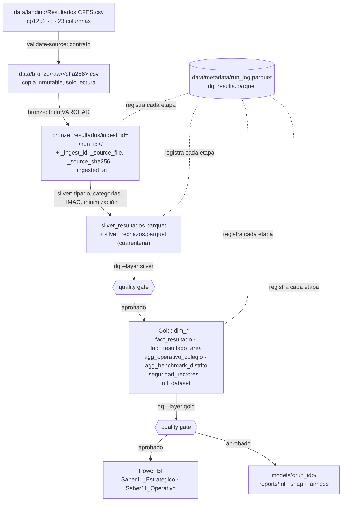

# Linaje de datos

De dónde viene cada número. El detalle columna a columna está en
[data_dictionary.md](data_dictionary.md); aquí está el **recorrido**: qué transforma cada
capa, qué identificador la enlaza con la anterior y cómo rehacer el camino en los dos
sentidos.

---

## 1. Recorrido completo

---

## 2. Qué hace cada salto

| Salto | Código | Qué cambia | Qué **no** cambia |
|---|---|---|---|
| CSV → `raw/` | `ingest/bronze.py` | Copia con nombre `<sha256>.csv` y atributo de solo lectura | Nada: es el original byte a byte |
| `raw/` → Bronze | `ingest/bronze.py` | Lectura con `delim=';'`, cp1252, **todo VARCHAR**; añade metadatos de ingesta | Los valores: no se tipa ni se limpia |
| Bronze → Silver | `sql/silver/01_texto.sql` … `04_salidas.sql` | Nombres a snake_case ASCII, tipado con `TRY_CAST`, categorías canónicas, `estudiante_pid` por HMAC, **PII eliminada**, flags de calidad | El número de filas: `Silver + rechazos = Bronze` (verificado en pruebas) |
| Silver → Gold | `sql/gold/01_dimensiones.sql` … `04_ml_y_seguridad.sql` | Claves sustitutas estables, estrella, agregados con supresión, `ml_dataset` | Los promedios: Gold = Silver (verificado) |
| Gold → BI | Power Query en los `.pbip` | Importa Parquet; nada se recalcula fuera de DAX | Los datos: el `.pbip` versionado no lleva caché |
| Gold → ML | `ml/dataset.py` | Selecciona predictoras y separa por año | El objetivo: `puntaje_global` tal cual |

### Qué alimenta cada tabla Gold

Todas salen de `silver_resultados`; cambia el grano y lo que se conserva. El detalle columna
a columna está en [data_dictionary.md](data_dictionary.md).

| Tabla | Grano | De dónde sale |
|---|---|---|
| `dim_tiempo` | Año × periodo | Valores distintos de `anio`, `periodo`, `jornada` |
| `dim_colegio` | Colegio | `nombre_colegio`, `naturaleza_colegio`, `modelo_pedagogico` |
| `dim_ubicacion` | Ubicación | `pais`, `departamento`, `municipio`, `zona` |
| `dim_perfil_estudiante` | Sexo × estrato | `sexo`, `estrato` (dimensión de basura: evita exponer el perfil en el hecho) |
| `dim_area` | Área | Catálogo fijo de las cinco áreas y su peso en el global |
| `fact_resultado` | Una evaluación | Una fila por fila de Silver, con las claves sustitutas resueltas |
| `fact_resultado_area` | Evaluación × área | `fact_resultado` despivotado: cinco filas por evaluación |
| `agg_operativo_colegio` | Colegio × año × área × dimensión | `fact_resultado` agregado con `GROUPING SETS` **y supresión aplicada** |
| `agg_benchmark_distrito` | Año × área × categoría | Igual, a nivel de distrito; exige `min_schools_comparative` colegios |
| `seguridad_rectores` | Correo × colegio | `config/seguridad_rectores.csv` (o el ejemplo), enlazado por nombre de colegio |
| `ml_dataset` | Una evaluación | `fact_resultado` con las variables admitidas en §16.2, sin puntajes por área |

---

## 3. Los identificadores que enlazan las capas

| Identificador | Dónde nace | Para qué sirve |
|---|---|---|
| `_source_sha256` | Hash del CSV de entrada | Dice **qué archivo exacto** produjo una fila; si vuelve el mismo, Bronze se omite |
| `_ingest_id` | `run_id` de la ejecución de Bronze | Partición de Bronze; Silver guarda cuál consumió |
| `run_id` | Cada etapa, en `run_log` | Une la fila publicada con su ejecución, su `git_sha` y sus parámetros |
| `resultado_id` | MD5 de seudónimo + año + periodo | Clave estable del hecho; no publica el seudónimo (ADR-0017) |
| `estudiante_pid` | HMAC-SHA-256 del documento | Enlaza al mismo estudiante entre cargas. **Se queda en Silver** |

`git_sha` y `git_con_cambios` acompañan a cada fila del `run_log`: si `git_con_cambios` es
`true`, el código de esa ejecución tenía cambios sin confirmar y el `git_sha` no la describe
por completo.

---

## 4. Rehacer el camino

**De un número del tablero al archivo de origen.** Ejemplo con «Promedio Global» de un
colegio y año:

1. La medida DAX agrega `fact_resultado[puntaje_global]` filtrado por `dim_colegio` y
   `dim_tiempo` → el detalle está en [bi/medidas_dax.md](bi/medidas_dax.md).
2. `fact_resultado` viene de `silver_resultados` sin recalcular puntajes; la equivalencia de
   promedios se comprueba en cada ejecución antes de publicar.
3. `silver_resultados._ingest_id` indica la partición de Bronze; `_source_sha256`, el archivo.
4. `data/bronze/raw/<sha256>.csv` es ese archivo, intacto.
5. `run_log` dice cuándo, con qué código y con qué parámetros se hizo cada paso.

**De una predicción del modelo a sus datos.** `models/<run_id>/params.json` guarda las
variables usadas y la semilla; `metrics.json`, el `run_id` del Gold consumido; y ese Gold, a
través del `run_log`, el Silver y el CSV de origen.

**De una celda en blanco del tablero operativo a su causa.** Si una métrica aparece vacía,
el motivo es la supresión: la celda tiene menos de `k_min` estudiantes, o es la supresión
complementaria que impide deducirla por diferencia (§15.6 del plan y ADR-0018). El campo
`suprimido` de `agg_operativo_colegio` lo marca explícitamente.

---

## 5. Lo que se pierde a propósito

| En la capa | Qué desaparece | Por qué |
|---|---|---|
| Silver | `nroDoc`, `nombre1`, `nombre2`, `apellido1`, `apellido2` | Minimización: el proyecto no necesita identificar personas (§21.3) |
| Gold | `estudiante_pid` | Un seudónimo sigue siendo dato personal y no aporta a BI: hay una evaluación por estudiante (§21.2) |
| Gold (agregados) | Métricas de celdas con `n < k_min` | Evitar la reidentificación en grupos pequeños (§15.6) |
| ML | `nombre_colegio` como predictora | Se reserva como grupo de validación: el modelo debe generalizar a colegios nuevos (§16.2) |

Nada de esto se puede reconstruir desde las capas publicadas: hay que volver a Bronze, que
está fuera de git y en zona restringida.
